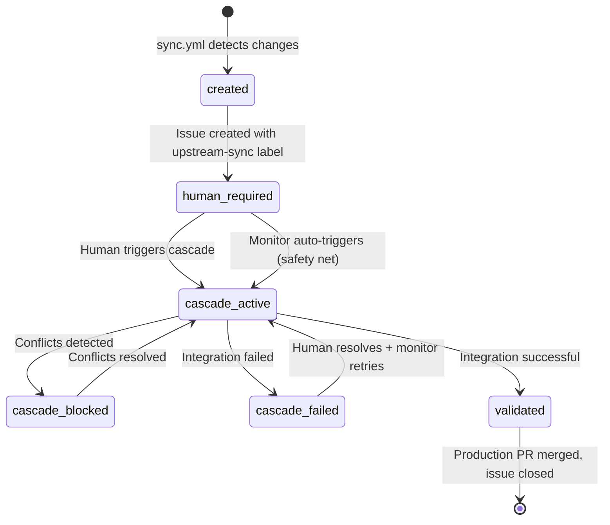

# ADR-022: Issue Lifecycle Tracking Pattern

## Status
**Accepted** - 2025-10-01

## Context

The three-branch cascade (ADR-001) and the human-centric cascade pattern (ADR-019) need a single place that shows where an upstream changeset is in the pipeline, whether it is blocked, and what a human should do next. Without it, that state is spread across workflow logs and several PRs, and a failure is easy to miss.

Requirements:

- One issue tracks the whole cascade lifecycle for one upstream changeset
- State is machine-readable through labels and human-readable through comments
- Conflicts and failures are visible on the issue, not only in logs

## Decision

Create one tracking issue per upstream sync and keep it current through the cascade:

1. **Issue creation**: `sync.yml` creates the issue titled `📥 Upstream Sync Ready for Review - <date>` with labels `upstream-sync,human-required`, subject to the duplicate prevention in ADR-024. The body carries the sync PR, upstream version, commit count, next steps, and a hidden `<!-- upstream-sha: ... -->` marker.
2. **State transitions**: `cascade.yml` takes the tracking issue number as its `issue_number` workflow input and moves labels as the cascade progresses.
3. **Progress comments**: each transition adds a timestamped comment with a link to the workflow run.
4. **Safety net**: `cascade-monitor.yml` comments on the issue when it auto-triggers a missed cascade or a retry.

### Issue State Machine

### Label Strategy

| Label | Meaning | Human Action | Next State |
|-------|---------|--------------|------------|
| `upstream-sync, human-required` | Upstream sync complete, awaiting manual cascade trigger | Review sync PR, merge, trigger cascade | `cascade-active` |
| `upstream-sync, cascade-active` | Cascade integration in progress | Monitor progress, wait for completion | `validated`, `cascade-blocked`, or `cascade-failed` |
| `upstream-sync, cascade-blocked` | Conflicts detected, manual resolution needed (48-hour SLA, escalated by the monitor) | Resolve conflicts, commit fixes | `cascade-active` |
| `upstream-sync, cascade-failed, human-required` | Integration failed, human intervention required | Review failure issue, fix problems, remove `human-required` label | `cascade-active` (automatic retry) |
| `upstream-sync, validated` | Production PR created, ready for final review | Review and merge production PR | Issue closed |

The transitions are implemented inline in `.github/template-workflows/cascade.yml`: `human-required` to `cascade-active` when the cascade starts, `cascade-active` to `cascade-blocked` on merge conflicts or validation failure, `cascade-active` to `cascade-failed,human-required` on an unrecoverable error, and every cascade label removed in favour of `validated` when the production PR is created. The `production-ready` label exists in `labels.json` but no workflow applies it.

## Alternatives Considered

1. **Workflow-only tracking**: no extra resources, but state is spread over many runs and invisible without opening logs. Rejected.
2. **One issue per stage**: precise, but proliferates issues and loses the overall story. Rejected.
3. **External tracking system**: more capable, but adds infrastructure and is not integrated with GitHub. Rejected.
4. **PR-based tracking only**: the sync PR closes at merge, before the cascade finishes, so its lifecycle does not match. Rejected.
5. **Project board**: needs manual card movement, less automatable than labels. Rejected.

## Consequences

Every sync creates an issue, so an abandoned cascade leaves an open issue behind; the monitor's stale-conflict escalation covers the `cascade-blocked` case but nothing closes an issue whose production PR was never merged. Label semantics are shared across `sync.yml`, `cascade.yml`, and `cascade-monitor.yml` (ADR-020), so a label change touches all three.

## Related ADRs

- [ADR-001: Three-Branch Fork Management Strategy](001-three-branch-strategy.md) - Defines cascade process being tracked
- [ADR-019: Cascade Monitor Pattern](019-cascade-monitor-pattern.md) - Human-centric cascade approach that this supports
- [ADR-020: Human-Required Label Strategy](020-human-required-label-strategy.md) - Label management strategy used for state tracking
- [ADR-005: Automated Conflict Management Strategy](005-conflict-management.md) - Conflict handling that this tracks
- [ADR-024: Sync Workflow Duplicate Prevention](024-sync-workflow-duplicate-prevention-architecture.md) - Issue creation and the `upstream-sha` marker

---

[← ADR-021](021-pull-request-target-trigger-pattern.md) | :material-arrow-up: [Catalog](index.md) | [ADR-023 →](023-meta-commit-strategy-for-release-please.md)
