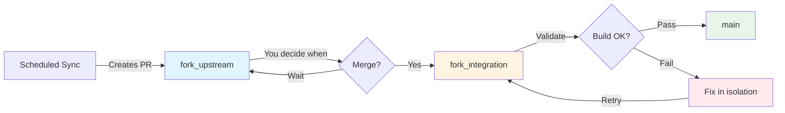
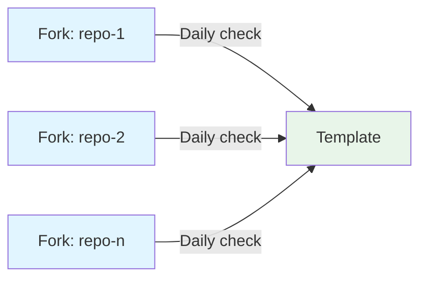

# Learnings

What building and running this fork management system taught us, one learning per section. Each points at the decision record that holds the detail. Newer learnings sit at the end.

---

## Isolation is what lets the team keep shipping

Upstream changes never land on `main` directly. Sync opens a PR to `fork_upstream`, the team decides when to merge it, and the cascade carries the result through `fork_integration`, where it is built and tested before a release PR reaches `main`. When integration breaks, the break is contained on `fork_integration` and fixed there while feature work on `main` continues. Adding a stage did not slow anyone down; it removed the case where an upstream change stopped everybody at once.

| Branch | Purpose | Can break? |
|--------|---------|------------|
| `fork_upstream` | Generated upstream tree | No; it accumulates until you are ready |
| `fork_integration` | Validation workspace | Yes; isolated from production |
| `main` | Protected production | Never; receives only validated changes |

See [ADR-001](001-three-branch-strategy.md) and [ADR-005](005-conflict-management.md).

---

## One repository owns the engineering system; the rest phone home

Every service fork needs the same workflows and actions but different upstream URLs, labels, and settings. The template owns the logic; each fork owns its data in config files. `sync-template.yml` checks the template daily and opens a PR in each fork when it has moved, and the fork owner chooses when to merge. Fixing a bug in `sync.yml` once is enough; the fix arrives everywhere as a reviewable PR instead of a hand edit in every repository.

See [ADR-011](011-configuration-driven-template-sync.md) and [ADR-012](012-template-update-propagation-strategy.md).

---

## Split what fails differently

The first initialization workflow handled user input and repository setup in one file and failed in two unrelated ways. Splitting it into `init.yml` and `init-complete.yml` gave each half one responsibility and one failure mode. The same rule separated `.github/workflows/`, which runs only in the template, from `.github/template-workflows/`, which forks receive at initialization; before that split every fork carried template-only infrastructure it never used.

See [ADR-006](006-two-workflow-initialization.md) and [ADR-015](015-template-workflows-separation-pattern.md).

---

## Human-triggered steps need a sweeper

The cascade is meant to be started by a person after reviewing the sync PR. People forget, and transient failures leave work stuck. `cascade-monitor.yml` runs every six hours, compares `fork_upstream` with `fork_integration`, finds merged sync PRs with no cascade, starts one, and retries a cascade whose `human-required` label has been removed after a fix. The sweeper is a safety net behind the manual path, not a replacement for it.

See [ADR-019](019-cascade-monitor-pattern.md).

---

## Know the event context before building a workaround

Cascade triggering failed because `pull_request` runs the workflow from the PR branch, and the branch did not contain the workflow yet. Switching to `pull_request_target`, which runs the workflow from the target branch, fixed weeks of unreliability with one line. The same context has a sharp edge: a read-only job that checks out the PR head under `pull_request_target` is a cache-poisoning finding in CodeQL (#164), so the validate-only Docker job never sets a checkout ref and never takes that lane.

See [ADR-021](021-pull-request-target-trigger-pattern.md) and [ADR-036](036-workflow-trust-boundaries.md).

---

## Labels are the state machine

Assigning issues to people failed on organization accounts, renamed users, and API errors. Labels have none of those problems and are queryable from any workflow. `cascade-active`, `cascade-blocked`, `validated`, and `human-required` carry the cascade's state across runs; removing `human-required` after a fix is the signal that lets the sweeper resume. The tracking issue itself is the audit trail for a process that spans hours or days.

See [ADR-020](020-human-required-label-strategy.md) and [ADR-022](022-issue-lifecycle-tracking-pattern.md).

---

## State that must survive a runner lives in GitHub metadata

A scheduled sync that cannot remember what it already did opens a duplicate PR every day. Upstream sync records the active upstream SHA in the tracking issue while a sync PR is open, records a commit that changed nothing in the fork's tree in the `SYNC_LAST_EVALUATED_SHA` variable, and finds its own branches and PRs by label. An unchanged upstream is a no-op, an advanced upstream updates the existing branch, and abandoned branches are cleaned up. Template sync uses the simpler form of the same idea with the `template-sync` label.

See [ADR-024](024-sync-workflow-duplicate-prevention-architecture.md) and [ADR-031](031-template-sync-duplicate-prevention.md).

---

## Add metadata instead of rewriting history

Release Please needs conventional commits; upstream does not write them. Rather than squash or rewrite upstream history, the sync adds one meta commit whose type is chosen by a fixed rule over the upstream range: breaking beats `feat` beats `fix`, and unclassifiable commits count as `fix`. The full upstream history stays intact for `git blame` and debugging, and versioning stays automatic.

See [ADR-023](023-meta-commit-strategy-for-release-please.md).

---

## Extract scripts so they can be run without a workflow

Bash embedded in workflow YAML cannot be run locally, duplicates across files, and is hard to debug. Scripts now live under `.github/actions/<name>/` with a composite `action.yml` wrapper, so the same file runs from a workflow, from a shell, and from the harness in `dev-ci.yml`. Logic that must exist in a fork's first commit, before any sync could deliver a fix, lives in `.github/local-actions/` for the same reason.

> Originally illustrated with `llm-provider-detect`, deleted in #162 with the AI path
> (ADR-014). The pattern is unchanged.

See [ADR-007](007-initialization-workflow-bootstrap.md) and [ADR-028](028-workflow-script-extraction-pattern.md).

---

## A fallback indistinguishable from success is a blindfold

The AI-enhanced PR description path was designed to degrade gracefully to a structured template when the model was unavailable.

**Outcome (2026-09-01, #162)**: The fallback was load-bearing in the strongest sense: it was the only path that ever ran. `aipr` crashed on every invocation for the life of the reference fork while the workflow reported success, and reviewers merged the fallback bodies without complaint. The lesson inverts: a fallback that cannot be distinguished from success is not resilience, it is a blindfold. Descriptions are now deterministic, and the meta-commit classification is a rule (ADR-023).

No replacement was adopted. GitHub Models was retired 2026-07-30, the Copilot coding-agent API rejects GitHub App installation tokens, and Copilot's PR summary has no API surface. Reopening this needs a provider that clears all three constraints.

See [ADR-014](014-ai-enhanced-development-workflow.md).

---

## Enforce trust boundaries in the workflow, not in review

The only job with a write credential today, `docker-push`, is gated by an `if:` clause that excludes Dependabot, `pull_request_target`, external-fork heads, and plain `workflow_dispatch`. The clause is the policy; a reviewer noticing a missing guard is not. Any future credential-bearing job copies it verbatim.

See [ADR-036](036-workflow-trust-boundaries.md).

---

## Generate the branch; do not merge into it

Stripping the other cloud providers from a fork cannot be done by deleting them and merging upstream afterwards. `git merge -X theirs` does not resolve modify/delete conflicts, the conflict recurs on every sync as the merge base advances, and the natural recovery, `git add -A`, restores the deleted files. Because `fork_upstream` is written only by sync and read only by the cascade, sync now builds the filtered tree from the upstream tip and writes it as a merge-shaped commit with git plumbing. Nothing is textually merged, so the conflict class cannot occur. The `-X theirs` merge survives only in initialization, for the first join of unrelated histories.

See [ADR-038](038-upstream-filter-transform.md).

---

## Halt on the unknown

The filter classifies every top-level entry, testing module, pom profile, and FOSSA module from a per-fork config. Anything the config does not name stops the sync with exit code 2 and a `sync-failed,human-required` issue, so a new shared upstream module is never silently deleted. The acceptance resolver applies the same rule to descriptors: an unknown key, source kind, or reserved environment name is a hard failure naming the key. Guessing would have been convenient exactly once and wrong forever after.

See [ADR-038](038-upstream-filter-transform.md) and [ADR-040](040-descriptor-acceptance-contract.md).

---

## Select the tier with a variable, because the tree cannot

Customer forks mirror a service repository's finished `main` instead of filtering upstream. The filter config file exists on both tiers, and at the mirror tier it arrives through the mirror itself, so its presence cannot say which tier a repository is on and deleting it would create a permanent difference against upstream. One repository variable, `SYNC_MODE=mirror`, is the selector; unset means today's behavior, so no existing repository changed.

See [ADR-039](039-customer-tier-mirror-sync.md).

---

## No environment values in the repository

The target environment is rebuilt weekly, workflows sync to many forks and on to customer mirrors with their own stacks, and the tests must also run against a personal stack. Any endpoint, tenant, or partition stored in a repository variable was therefore stale by construction; a prior prototype's sticky `DEPLOY_VALIDATED` flag kept vouching for an environment that no longer existed. Each fork now declares only what its suite needs, in `.spi/service.yaml`, and one template-owned resolver reads the live facts per run.

See [ADR-040](040-descriptor-acceptance-contract.md).
