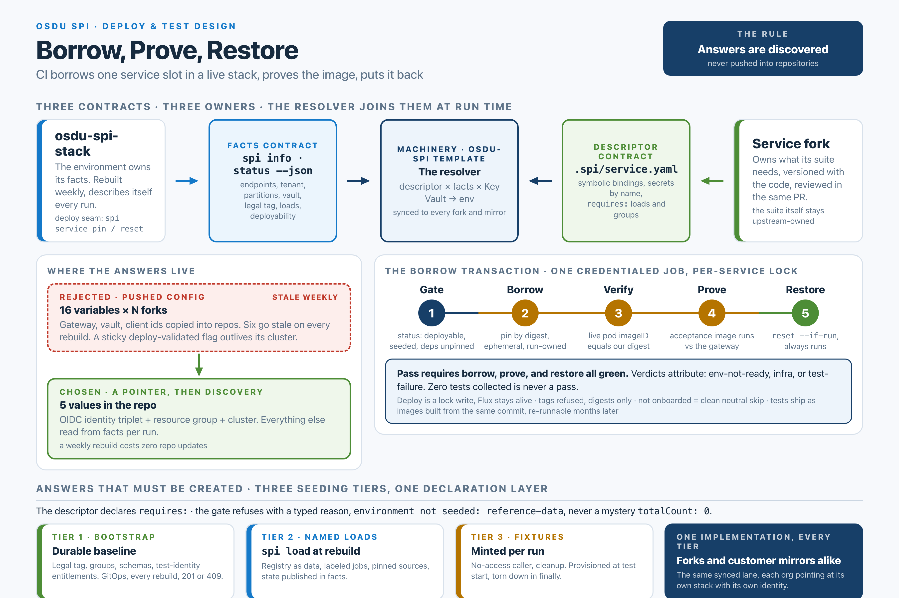

# Borrow, Prove, Restore: Deploy & Test Design



> After CI builds a service image, **borrow** the service's slot in a running SPI stack, **prove** the image with the acceptance suite, and **restore** the slot. Every environment answer is **discovered at run time**, never pushed into a repository.
>
> Status: Core lane built; remaining design items are tracked below · designed 2026-08-31, lane shipped 2026-09-10 (ADR-040, ADR-041) · Applies to the filter tier and the customer mirror tier · History in [the "deploy & test capability" tracking issue](https://github.com/Azure/osdu-spi/issues/158). Where this document and the two records differ, the records govern.

## Implemented lane and remaining work

[ADR-041](../adr/041-borrow-prove-restore-lane.md) and the
[validation workflow](https://github.com/Azure/osdu-spi/blob/main/.github/template-workflows/validate.yml)
define the shipped lane. The investigations, principles, seeding model, and
rollout plan below also describe intended capabilities; they are not a checklist
of implemented gates.

- Eligible same-repository PRs and pushes both borrow, test, and restore. Passing
  a push run does not leave its image deployed as the environment's canonical.
- The lane resolves descriptor bindings from facts and minted caller tokens.
  Key Vault materialization is not wired ([#175](https://github.com/Azure/osdu-spi/issues/175)).
- Descriptor `requires.loads`, `requires.groups`, and `dependencies` are not
  enforced before borrowing ([#176](https://github.com/Azure/osdu-spi/issues/176));
  named loads remain stack work ([stack #133](https://github.com/Azure/osdu-spi-stack/issues/133)).
- Live-image verification runs after the pin. A second verification immediately
  before each suite is not implemented. The undeclared-environment-read tripwire
  is also pending ([#156](https://github.com/Azure/osdu-spi/issues/156)).


## §1 Problem and constraints

The engineering system builds and pushes a digest-addressed service image per commit (the `docker-push` job in `validate.yml`). Before this lane, nothing deployed that image or proved it against a live platform. The end state: each internal push or PR deploys its image into the shared `osdu-spi-stack` AKS environment, runs the service's acceptance suite against it, and returns the environment to its previous state, as a required check.

The hard part is not the deployment. It is the question every OSDU test asks first: *where is the service, how do I authenticate, and which identifiers do I use?* The subgroup-core wiki names the root cause of a decade of pain:

> "The tests are in the repository; the knowledge of how to run them is not."

Upstream keeps the answers in four providers' pipelines; severing those pipelines orphaned the tests. Every requirement below is a constraint on where that knowledge is allowed to live:

- **The environment is disposable.** The stack is designed to be torn down and rebuilt weekly. Any environment value copied into a repository is stale by construction.
- **The machinery is multiplied.** Workflows sync from the template to N service forks, and onward to customer mirror forks that point at *their own* stack with *their own* credentials. Nothing environment-specific or Microsoft-specific can be baked in.
- **Developers come first.** The same tests must run against a personal stack instance during development, with no CI in the path.
- **Releases must stay provable.** "Run the tests that shipped with release X against stack Y" must remain a one-command operation months later.
- **CI must stay fast and honest.** Fail in seconds with a typed reason when the environment isn't ready; never report green for a suite that didn't run.

## §2 Evidence: five investigations, one convergence

Five bodies of prior work were investigated in depth. They sort into two generations of answer to "where do the answers live":

| Source | Finding |
|---|---|
| **subgroup-core acceptance engine** (`ci/acceptance/engine.py`) | Generation 2. Per-service declarative contract (`test-env.yaml`, closed source vocabulary) resolved against a versioned `cimpl facts` envelope; test images tagged with the same SHA as the service image. Proven on 13 services. Partition's entire answer set: seven variables. |
| **cimpl-test CLI** | Generation 2, consumer side. "Consume, don't own": facts carry secret *references*, never values; verdicts carry attribution (env-not-ready / infra / test-failure) and provenance (was the suite fetched at the deployed commit?); fixtures mint what can't be looked up. Its ADR-0002: "Two resolvers with drifting semantics is the failure mode this project exists to end." |
| **yuchen-osdu/osdu-spi prototype** | Generation 1 transport, generation 2 contract. A working deploy lane: digest-only deploys, transactional deploy→test→restore, OIDC federated identity, secretless token minting, descriptor-owned acceptance contract (its ADR-043). But config transport is ~16 repo variables pushed per fork by `spi onboard`, six stale on every rebuild, plus a sticky `DEPLOY_VALIDATED` boolean that never expires. The descriptor already assumes late-bound facts; only the transport is baked. |
| **osdu-spi-stack** (v0.6.0) | Generation 2, half-built. The target environment already built the two seams this design needs: a CAS-safe image-lock deploy surface (`spi service pin/reset`, its ADR-031, which rejects `kubectl set image` because Flux reverts it) and a versioned discovery contract (`spi info/status --json`, `apiVersion: spi.osdu.dev/v1`, ADR-030). The ephemeral pin surface has since shipped (stack PR #134); per-fork identity (ADR-032) and the weekly reset are designed but unbuilt. Two gaps: nothing creates legal tags; no usable test-caller identity. |
| **cimpl-stack load concept** (`src/cimpl/load.py`) | The seeding tier model. Three deliberately separated mechanisms: GitOps *bootstrap* (legal tag, idempotent 201-or-409), CLI-triggered *named loads* (labeled k8s Jobs, `skipdupes` + 409-as-success), ephemeral *test fixtures* with teardown (its ADR-016/025). Never wired into CI; load state never published; provenance unpinned. Missing only its declaration layer. |

**The arbitration finding.** The prototype fork and the stack repo carry dueling ADR sets from the same month. The prototype's deploy mechanics (suspend Flux + `kubectl set image`) are rejected by the stack's newer ADR-031; the stack's config placeholders (operator-set `ACCEPTANCE_TEST_SECRET_MAP` variables) are rejected by the prototype's newer ADR-043. **This design is the union of each repo's latest decision**, with the stale half of each dropped.

## §3 Principles

1. **Answers are discovered, never pushed.** A repository holds a *pointer* to a stack and an identity to reach it, nothing else. Everything environment-shaped is read per run from the stack's versioned facts contract.
2. **Contracts are branch-versioned with the code they describe.** What a suite needs travels in the service repo, reviewed in the same PR as the test change.
3. **One resolver, one agreement point.** Where two components could resolve the same answer, one owns it and the other asserts agreement. A mismatch is a typed infra error, never a silent preference.
4. **Digests, not tags.** Deploy by digest, verify the live pod's `imageID` post-rollout and again pre-test. "Did I test what I built" must be answerable.
5. **Zero long-lived secrets.** GitHub OIDC → federated managed identity; tokens minted per run; Key Vault reads at run time; secret references in contracts, never values.
6. **Fail closed, with typed reasons.** Maintenance, not-seeded, not-onboarded, dependency-pinned: each is a distinct machine-readable refusal, reported in seconds, never a mystery test failure.
7. **One implementation for every tier.** The same synced workflows serve Microsoft filter-tier forks and customer mirror forks; the pointer and identity are the only per-org values.

## §4 Architecture: three contracts, three owners

The same three-owner split subgroup-core proved: the environment owns its facts, the service owns its contract, the engineering system owns the machinery. Because the acceptance suite (`<svc>-acceptance-test`) is upstream-owned and regenerated on every sync, nothing fork-specific can live inside it. The contract lives beside it, in the fork-owned lane.

| Contract | Owner | Content |
|---|---|---|
| **Facts**: `spi info --json` · `spi status --json` (`apiVersion: spi.osdu.dev/v1`) | osdu-spi-stack | What the environment knows about itself: endpoints, tenant, data-plane client id, partitions, Key Vault name, deployability, maintenance state, pinned services, seeded loads. Consumed per run, cached nowhere. |
| **Descriptor**: `.spi/service.yaml` (schema v3) | each service fork | What this service's suite needs, symbolically: which module or image is the suite, bindings from a closed source vocabulary, Key Vault secret references, required loads and groups, dependencies, timeouts. Sync-excluded, CODEOWNERS-protected. |
| **Machinery**: `.github/actions/*` + `template-workflows/validate.yml` | osdu-spi (template) | The resolver that joins descriptor × facts × Key Vault into an env map, the acceptance-image build, the transactional deploy lane, the drift tripwire, the required-check summaries. Synced to every fork; carried to mirrors. |

### The descriptor, concretely

```yaml
# .spi/service.yaml: fork-owned, reviewed with the code, survives any stack rehome
schemaVersion: 3
service: { name: partition, archetype: java-maven-azure }
tests:                                  # named suites of one shape; acceptance is required
  acceptance:
    type: maven
    path: partition-acceptance-test     # upstream-maintained module, kept by the filter
    mavenArguments: [test]
    bindings:                           # symbols, never values; resolved against facts per run
      HOST:                  { source: gateway }
      DATA_PARTITION_ID:     { source: partition }
      PRIVILEGED_USER_TOKEN: { source: token }     # the run's minted bearer (RESOLVER_TOKEN)
    timeoutMinutes: 15
  integration:                          # the fork-owned provider suite, selectable by name
    type: maven
    path: testing
    mavenArguments: [-pl, partition-test-azure, -am, test]
    bindings:
      ENVIRONMENT:        { source: static, value: dev }
      PARTITION_BASE_URL: { source: gateway, suffix: / }
      MY_TENANT:          { source: partition }
      INTEGRATION_TESTER_ACCESS_TOKEN: { source: token }
    timeoutMinutes: 20
```

Every suite may also carry `keyVaultBindings` (env name to Key Vault secret name), `requires` (`loads`, `groups`), and `dependencies`; the partition suites need none of them.

Ports the prototype's ADR-043 contract (reserved-name blocklist, argv-token Maven args, no identity/cluster selection) and subgroup-core's closed-vocabulary posture: an unknown source kind halts loudly. Resolution precedence: explicit env → facts → declared default; templates render last, so the same contract runs in CI, against a personal stack, or fully offline. `token`, `memberToken`, and `noAccessToken` are the caller inputs with fixed names, `RESOLVER_TOKEN`, `RESOLVER_MEMBER_TOKEN`, and `RESOLVER_NO_ACCESS_TOKEN`, so the lane and a developer supply the bearers the same way whatever a suite calls them.

### What the repository holds, in full

| Value | Kind | Why it may live in the repo |
|---|---|---|
| `AZURE_CLIENT_ID` / `AZURE_TENANT_ID` / `AZURE_SUBSCRIPTION_ID` | secrets | The org's OIDC identity for its own stack. Stable across rebuilds (identity lives in a persistent RG). |
| `SPI_STACK_RESOURCE_GROUP` · `SPI_STACK_CLUSTER` | variables | The pointer. Derived from the stack's environment declaration; stable across rebuilds by design. |
| `SERVICE_NAME` (existing, optional) | variable | Repo-name fallback already in place. |

That is the entire per-repo surface. The prototype's other ~13 pushed variables (`GATEWAY_URL`, `KEYVAULT_NAME`, `STORAGE_ACCOUNT_NAME`, `AAD_CLIENT_ID`, `K8S_*`, …) all become facts read per run, so a weekly rebuild costs **zero reconciliation** across N forks and M mirrors.

## §5 The CI lane: one borrow transaction

One credentialed job, `deploy-test`, chained on `docker-push` in `validate.yml` behind a gate job that carries the ADR-036 trust clause (push or same-repository pull request; never Dependabot, `pull_request_target`, or `fork_upstream`) and always says why the lane did not run. It runs on the fork's own pull requests and again on the push after merge, since the merge is a new build with a new digest. Concurrency group `spi-stack-<service>`, `cancel-in-progress: false`.

```
gate    → deploy-gate                 trusted event? onboarded? descriptor? image pushed?
install → the spi release the environment runs (environment.stackVersion from spi status)
gate    → spi status --json          deployable? (descriptor requirements are not yet enforced)
borrow  → spi service pin --image ghcr…@sha256:… --ephemeral --run-id $GITHUB_RUN_ID
verify  → spi service verify         poll until the live pod imageID == our digest
mint    → OIDC exchange as the deploy identity (AZURE_CLIENT_ID)         → RESOLVER_TOKEN
        → OIDC exchange as deploy_identity.member_client_id                → RESOLVER_MEMBER_TOKEN
        → OIDC exchange as deploy_identity.no_access_client_id             → RESOLVER_NO_ACCESS_TOKEN
bind    → resolver --suite <name>: descriptor × facts × tokens → <name>.env
prove   → docker run --env-file <name>.env -e SUITE_DIR=<path> <svc>-acceptance@<digest>   per suite
restore → spi service reset --if-run $GITHUB_RUN_ID           (if: always)
verdict → validation-summary: one table; fails on any failed or cancelled build, push, or deploy job
```

- **Deploy is a lock write, not a kubectl mutation.** `spi service pin` updates the `osdu-image-lock` ConfigMap under compare-and-set; Flux re-renders the HelmRelease. GitOps stays alive the whole time: no suspended-Flux CI mode, no weekly first-deploy failure, no loss of self-healing (stack ADR-031: "a lock write is the whole deploy"). The pin returns at the lock write (the fork identity holds no Flux write; the lock's watch label triggers reconciliation), so the lane polls `spi service verify` until the digest is live or the borrow budget expires. A typed `lock_mismatch` from verify means the pin was replaced mid-borrow.
- **Restore is ownership-checked.** `reset --if-run` restores the recorded canonical only while the live pin still belongs to this run, so a crashed run can't be "restored" over a newer sibling. The Restore step runs after eligible PR and push tests, including failures, once CLI installation succeeded. A failed runner can still strand a pin; restore is attempted, not guaranteed. Canonical advancement is separate from testing a push image.
- **Not-onboarded is a visible skip.** When the pointer variables are absent, the gate reports "repository is not onboarded to a stack" and the lane does not run; the summary check stays green. The same ruleset serves every fork, onboarded or not.
- **The gate replaces the sticky boolean.** `spi status` is consulted every run. The lane polls deployability every 20 seconds for up to ten minutes, reporting the status reason if the environment remains blocked, including maintenance. Borrow retries a pin refusal while status is not deployable on the same bounded schedule.
- **Verdicts carry attribution** (cimpl-test's taxonomy): env-not-ready, infra, and test-failure are distinct outcomes; a suite that collects zero tests is never a pass; an interrupted run is never a pass.

## §6 Answers that must be created: the seeding tiers

Some answers can't be discovered because nothing creates them: the two gaps found in the stack (no legal tag, no test-caller entitlements) and the shapeless per-service `setup.sh` problem both engines left open. cimpl-stack's separation (its ADR-016 and ADR-025) supplies the tier model; this design adds the declaration layer that nobody built.

| Tier | Content | Mechanics |
|---|---|---|
| **Tier 1, Bootstrap** | Baseline the platform is not usable without: legal tag + partition config + COO catalog (port of cimpl-stack's `legal-bootstrap.yaml`, Blob instead of MinIO), entitlements groups, schemas, and the *test-identity ensure step* seeding the test callers' entitlements. | GitOps-reconciled Jobs · every rebuild, automatically · idempotent by HTTP status (201 created / 409 exists) · results published as facts (e.g. `legalTag`). |
| **Tier 2, Named loads** | Persistent shared data: reference data, sample datasets. `spi load`: labeled Kubernetes Jobs (`role=data-load`, `dataset=<name>`; the label pair is the whole state contract) driven by a registry, batch-PUT with `skipdupes`, 409-as-success, ≤1% failure threshold. | Last stage of the rebuild pipeline, not manual · "ready" and "seeded" are separate signals · four fixes over cimpl-stack: registry as YAML data not CLI code; runs unattended at rebuild; sources mirrored + digest-pinned beside the chart pins; state published durably in `spi info` (Jobs TTL away in 24h). |
| **Tier 3, Fixtures** | Per-run, identity-shaped state: impersonation targets, pre-suite cleanup. | Test harness, driven by descriptor declarations · provisioned at test start, torn down in `finally`, orphans reaped next run · never persisted. |

Boundary rule (cimpl-stack ADR-025, adopted verbatim): *persistent state → a declared load; per-run identity → an ephemeral fixture.*

**Planned: declared data dependencies.** The descriptor's `requires` block names loads and groups; the planned lane gate checks them against published load facts and refuses with a typed reason (`environment not seeded: reference-data`) instead of the industry-standard failure mode, an acceptance test returning `totalCount: 0` and a human reading a runbook. For the eight core services, Tier 1 alone covers most suites; `requires.loads` is expected mainly for search and indexer, which keeps rebuilds and CI cheap.

## §7 Identity

The stack implements the deploy identity and onboarding trust from ADR-032:

- **One deploy identity per environment**, a user-assigned managed identity in the environment's resource group, with one federated credential per trusted fork whose subject is the one GitHub signs for `repo:<org>/<fork>:environment:spi-stack`. The GitHub environment is used for identity protection, not config storage, and admits every branch: write access to the fork is the boundary, and a pull request from another repository never receives an OIDC token.
- **Least-privilege Azure roles**: AKS Cluster User + Key Vault Secrets User. **Namespace-scoped Kubernetes Roles**: lock-object patch restricted by `resourceNames` to `osdu-image-lock`; read-only over deployments/pods/logs; no create, no delete, no secrets verbs.
- **Test callers, secretless**: the positive-path token is minted per run as the deploy identity for the audience the facts publish as `azure.token_audience`; the Azure-provider services admit any app-only token from the tenant, so no entitlements seeding is needed for the suites built so far. A developer mints the same token with `spi token`. Tokens for the stack's *member* identity, a plain user with no admin rights, and its *no-access* identity, a caller with no entitlements, are minted the same way and reach bindings with `source: memberToken` and `source: noAccessToken` as `RESOLVER_MEMBER_TOKEN` and `RESOLVER_NO_ACCESS_TOKEN`. No long-lived secrets anywhere.
- **Onboarding** = `spi onboard <service> --repo <org>/<fork>`: the federated credential on all three identities, the open `spi-stack` environment, the five repository values, and the fork's entry in the cluster's trusted-repository projection. Nothing arms afterwards; the lane runs on the next trusted event.

**Customer mirrors**: the identical machinery arrives by mirror sync. A customer runs their own stack (same CLI, same facts contract), sets their own pointer + identity triplet at adoption time (an `Adopt Fork` extension), and pins their own GHCR images. External-fork PR heads never reach the credentialed lane; the existing ADR-036 gate already guarantees it.

## §8 Tests as images; the developer and release loops

CI builds `<svc>-acceptance:<sha>` beside the service image, from the same commit, with dependencies prewarmed at build time (`dependency:go-offline`), subgroup-core's proven pattern and its rationale: *"run the tests that shipped with release X" must stay one command months later*. The image pins the suite source and a warmed local repository, not dependency resolution: the run is online, and version ranges in the upstream graph can still resolve differently later. The engineering system owns the canonical acceptance Dockerfile, exactly as it owns the service Dockerfile (ADR-037). The suite runs on the GitHub runner via `docker run --env-file` against the gateway; inside the cluster it would need create-verbs the fork identity deliberately lacks.

The developer loop uses the same three contracts with no CI in the path:

```bash
# once: stand up or connect to your own stack
spi connect -g my-rg -c my-cluster && spi status

# the callers: the environment's deploy, member, and no-access identities, minted through the cluster
export RESOLVER_TOKEN=$(spi token)
export RESOLVER_MEMBER_TOKEN=$(spi token --member)
export RESOLVER_NO_ACCESS_TOKEN=$(spi token --no-access)

# resolve answers: descriptor × facts × vault → .env  (bind warns; run refuses: two audiences)
spi info --json > facts.json
python3 .github/actions/acceptance-resolver/resolve.py --mode bind --suite acceptance \
  --descriptor .spi/service.yaml --facts facts.json --env-file .env

# the env file is `docker run` data, never shell code: mvn does not read it,
# and sourcing it would evaluate secret values as shell. consume it through
# the suite image, exactly as CI does (rebuild the image locally to iterate):
docker run --env-file .env ghcr.io/<org>/partition-acceptance:<sha>

# another suite from the same image: its own bindings, its own env file
python3 .github/actions/acceptance-resolver/resolve.py --mode bind --suite integration \
  --descriptor .spi/service.yaml --facts facts.json --env-file integration.env
docker run --env-file integration.env -e SUITE_DIR=testing ghcr.io/<org>/partition-acceptance:<sha> -pl partition-test-azure -am test

# explicit env always wins: point the base URL at a laptop service
PARTITION_BASE_URL=http://host.docker.internal:8080/ python3 .github/actions/acceptance-resolver/resolve.py --mode bind ... \
  && docker run --env-file .env ghcr.io/<org>/partition-acceptance:<sha>
```

**Release verification**: `release.yml` tags the acceptance image alongside the service image, so "prove release X on stack Y" is one `workflow_dispatch` with two inputs, or one local `docker run`. An optional nightly scheduled run re-converges the fleet against the shared stack.

**The drift tripwire**: a build-stage static check (no cluster, no secrets, safe on any PR) fails the build when suite code reads an environment variable the descriptor doesn't declare, printing the file, the line, and a paste-ready declaration. New requirements surface at review time, not as a red deploy three repos downstream.

## §9 Decision register

*Settled* = the evidence decides it (a source proved it, or the counterpart approach demonstrably failed). *Judgment call* = this document decides it and review can flip it without unraveling the rest.

| # | Decision | Status | Over (rejected) |
|---|---|---|---|
| D1 | Deploy through the stack's image-lock pin, never direct cluster mutation. Restore is `reset --if-run`. | Settled | Suspend-Flux + `kubectl set image`: reverted by reconciliation unless the stack lives permanently in CI mode, costing self-healing and failing the first deploy after every rebuild. Stack ADR-031 already rejected it. |
| D2 | Config transport is a pointer plus per-run discovery: repos hold five values (§4); everything else from `spi info/status --json` per run. | Settled | Pushing ~16 facts per fork: six go stale weekly across N forks with no reconciliation loop; GitHub Environments as config storage. Discovery is proven twice and mandated by the mirror tier. |
| D3 | Test configuration is a fork-owned descriptor with symbolic bindings (closed vocabulary, halt-on-unknown, reserved-name blocklist, branch-versioned). | Settled | Repo-variable config (not branch-versioned, not reviewable with test changes); free-form Maven command strings. Proven by subgroup-core on 13 services; re-derived independently by prototype ADR-043. |
| D4 | Gate on live environment status every run; a fork that is not onboarded skips with a visible reason under the same required check. | Settled | The sticky `DEPLOY_VALIDATED=true` boolean: it keeps asserting a canary that ran against an environment that no longer exists. Per-fork ruleset filtering, which the visible skip makes unnecessary. |
| D5 | Acceptance tests ship as images, built from the same commit as the service image; canonical Dockerfile owned by the template. | Settled | Bare Maven on the runner per run: loses months-later re-runnability of released tests and re-resolves dependencies every CI run. |
| D6 | Test images execute on the runner (`docker run --env-file` against the gateway), not in-cluster. | Judgment call | A Kubernetes Job in-cluster: closer to production networking, but requires create/delete verbs the fork identity deliberately lacks (stack ADR-032), plus log/lifecycle machinery. Cost accepted: runner→gateway egress must be open. |
| D7 | Positive test caller is the environment's deploy identity, minted per run for `azure.token_audience`; the stack's member and no-access identities are minted the same way. Fully secretless. | Settled | One shared acceptance-tester SP with a client secret in Key Vault: revives a long-lived credential. A per-fork identity: the stack chose one deploy identity per environment (its ADR-032), and partition-class services admit any tenant app-only token, so per-fork attribution bought nothing. |
| D8 | Default suite is the upstream `<svc>-acceptance-test` module (kept by the filter, community-maintained); it runs on Entra as-is, taking a static `PRIVILEGED_USER_TOKEN`. The fork-owned `testing/<svc>-test-azure` is a second named suite in the same image. | Settled | Defaulting to the fork-owned Azure testing module: fork-maintained forever, and drifts from the community suite. One image per suite: more to tag and retain for no gain. |
| D9 | A pinned dependency blocks the gate: wait briefly, then refuse with a typed reason (visible via `spi status` → `pinnedServices`). | Judgment call | Advisory-only probes (a contaminated pass was still a pass) and a fleet-wide lock (serializes all services on no evidence of universal conflict). |
| D10 | The resolver lives in the template as a synced action; the stack CLI stays the sole authority on facts; one agreement point cross-checks endpoint/partition. The lane runs the CLI release the environment reports. | Judgment call | Folding resolution into the `spi` CLI: one tool, but couples test semantics into the environment's release cadence and adds a version-skew axis. |
| D11 | Seeding follows the three-tier model with descriptor-declared requirements (`requires`) and load-state facts. | Settled | Test-harness-owned seeding (every suite re-seeds, slow and racy); load-as-GitOps (a failed 80k-record load should never block platform readiness). |
| D12 | Loads run at rebuild time with pinned, mirrored sources; registry as YAML data; state published durably in facts. | Judgment call | Manual-afterthought loads (right for a laptop, wrong for an unattended weekly rebuild); live-fetch-from-community-master provenance (two "identical" environments holding different data). Mirror/digest work may fast-follow but not past Phase 3. |

## §10 Work split and sequencing

**Azure/osdu-spi-stack**: ephemeral pin surface (`pin --image/--ephemeral/--run-id`, `service verify`, `reset --if-run`; shipped, stack PR #134) · `spi onboard` + per-fork UAMI, federated credential, namespace Roles (ADR-032) · Tier-1 bootstrap: legal-tag port + test-identity ensure step · `spi load` + YAML registry + load facts · weekly reset · `loads`/`legalTag` additions to the facts envelope.

**Azure/osdu-spi (template)**: descriptor schema v3 + resolver action (port of prototype ADR-043's resolver, generalized from repo-vars to facts) · acceptance-image build + canonical acceptance Dockerfile · the borrow-transaction job in `validate.yml` + required-check summaries · drift tripwire · release/dispatch lanes · ADRs (resolving the 038/039 numbering collision with the prototype's set) · `Adopt Fork` extension for mirror pointers.

**Service forks**: one `.spi/service.yaml` each, typically seven to ten symbolic bindings.

Phases (1 and 2 complete on partition, 2026-09-10):

1. **Prove the contracts on partition, by hand.** Descriptor + resolver + acceptance image on `osdu-spi-partition`; bind and run manually against the shared stack using today's built surface. *Exit: a green partition acceptance run whose every answer came from facts, with zero pushed environment variables.*
2. **Build the seams.** Stack: ephemeral pin surface, onboarding, Tier-1 bootstrap, `spi token`. Template: the transactional lane wired into `validate.yml`, the gate that explains a skip, the summary as the required check. *Exit: partition PRs run borrow → prove → restore unattended.*
3. **Arm and harden.** Required checks armed by onboarding verification; drift tripwire on; D9 dependency gate on; `spi load` + `requires` for search/indexer; nightly run; descriptors rolled out across the remaining forks. *Exit: the fleet gates merges on proven images; a weekly rebuild needs no repo-side action.*
4. **Extend to the mirror tier.** `Adopt Fork` collects the pointer + identity; docs for customer stack onboarding; release-verification dispatch lane. *Exit: a customer proves their change green in their environment with the same machinery, untouched.*

## §11 Open items and risks

- **Coordination before code.** This design arbitrates between the prototype's ADRs and the stack's ADRs; both authors should review the "union of latest decisions" framing (§2) before either repo lands its half. The prototype's ADR numbering collides with the template's (038/039 mean different things); renumber during porting.
- **Tier-2 initial scope.** Registry + `spi load` + load facts are required for §6; the mirror/digest provenance work (D12) can fast-follow, but unpinned community-`master` data will eventually cost a debugging day, so it should not slip past Phase 3.
- **Entitlements for other services.** Partition admits any app-only token from the tenant, so the deploy identity needs no seeding there. Services that check entitlements need the stack's members Job to seed the deploy identity before their suites can join the lane, and a suite that declares `NO_ACCESS_USER` binds its `NO_ACCESS_USER_TOKEN` with `source: memberToken`. The no-access identity stays unseeded.
- **Runner egress.** D6 assumes the gateway is reachable from GitHub-hosted runners. True today (public FQDN); if the stack ever goes private-endpoint, revisit D6 (self-hosted runners or the in-cluster Job alternative).
- **Chart-contract changes don't ride the image seam.** A service change needing a new chart env var lands a stack PR first, then the fork PR deploys against the upgraded environment (stack ADR-031's sequencing note). Document this in the fork contribution guide.
- **Concurrency starvation.** Per-service groups with `cancel-in-progress: false` can queue long chains on a busy fork; descriptor `timeoutMinutes` caps each hold, and the gate's typed refusals keep waits explainable.

## §12 Source map

| Concern | Read first |
|---|---|
| Contract + resolver semantics, dev loop, drift tripwire | `subgroup-core/ci/acceptance/engine.py` · `wiki/pages/design/venus-core-prototype/acceptance.md` |
| "Consume, don't own"; attribution; provenance; fixtures | `cimpl-test/docs/decisions/0002-resolution-backends.md` · `src/cimpl_test/envdiscovery/` · `fixtures/` |
| Descriptor contract; secretless tokens; transaction shape | `yuchen-osdu/osdu-spi`: its ADR-043 · `.github/scripts/service-config/` · `.github/actions/integration-test/` |
| Pin seam; facts contract; identity; lifecycle | `osdu-spi-stack`: `docs/decisions/030–032` · `docs/design/fork-deployment.md` · `src/spi/{pins,info,status}.py` |
| Seeding tiers; legal-tag bootstrap; load jobs | `cimpl-stack`: `docs/decisions/{016,025}` · `software/stacks/osdu/bootstrap/legal-bootstrap.yaml` · `src/cimpl/load.py` |
| Existing trust gate + docker outputs (the hook point) | `osdu-spi/.github/template-workflows/validate.yml` (`docker-push`) · ADR-036 · `upstream-filter.yml` |
