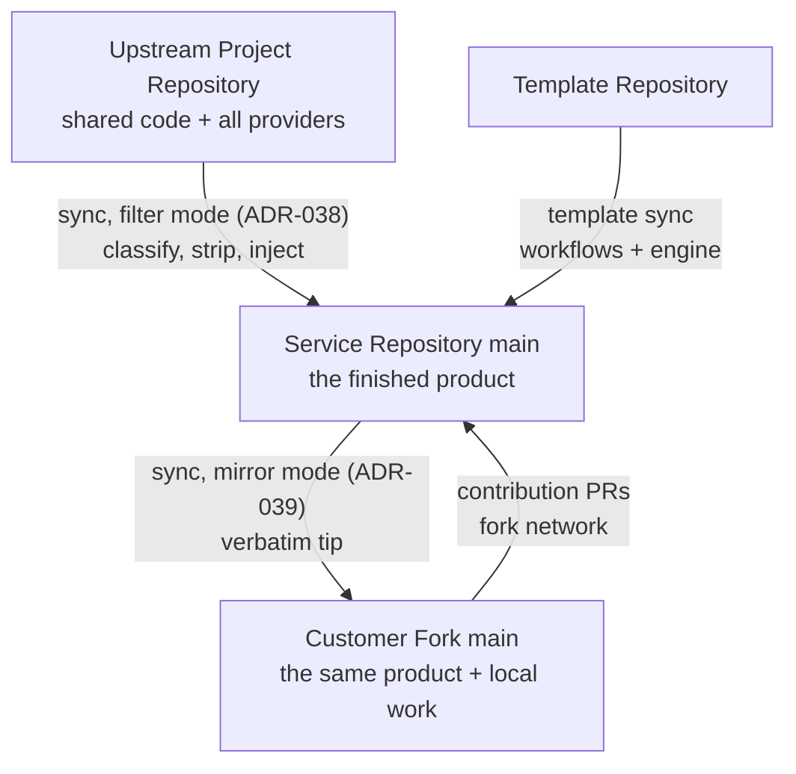

# Fork Tiers

The fork management system operates at two tiers. Both run the same workflows, the same three-branch model, and the same cascade. They differ in what their upstream is and in how sync treats what it receives.

## The Tier Model

| | First tier (service repository) | Customer tier (mirror fork) |
|---|---|---|
| Created by | Template instantiation + initialization | GitHub fork + the `Adopt Fork` workflow |
| Upstream | The upstream project repository | The service repository's `main` |
| Sync behavior | Filter: classify, strip providers, inject Azure references | Mirror: verbatim upstream tip |
| `SYNC_MODE` variable | Unset (or `filter`) | `mirror` |
| Fork-owned content | `provider/<svc>-azure`, `testing/<svc>-test-azure`, `.github/`, `build/` | Local feature work only; everything else is upstream-owned |
| Cascade assertion and pom stamp | Active | Off (no ownership split to defend) |
| Template sync | Active | Off (updates arrive through the mirror) |
| Sync PR build profile | `core` only (`fork_upstream` is provider-less) | Full profile set (`fork_upstream` carries `provider/`) |
| Workflow updates arrive via | Template sync | The mirror of the parent's `main` |

## Why the Customer Tier Is a True Fork

A pull request's head branch must live in the target repository's fork network. A customer who wants to contribute a change back to the service repository can only do so from a GitHub fork of it. That single constraint fixes the creation mechanism: customer repositories are forks, never template instantiations. The fork also inherits every deployed workflow from the parent's `main` at creation, which is what makes adoption lightweight (see [Adoption](../workflows/adoption.md)).

## Why Mirror Mode Exists

The filter (ADR-038) reduces an upstream project's tree to the product: it strips the providers the fork does not ship and halts on anything unclassified. The service repository's `main` already is the product. Running the filter against it would halt on `.github/`, `build/`, and the changelog, and would strip `provider/`, the code a downstream consumer needs most. Mirror mode takes the upstream tip verbatim through the same commit plumbing: merge-shaped commits, `Upstream-Sha` trailers, and the sentinel `Filter-Rev: mirror`, so provenance and no-op semantics are identical at both tiers while the engine itself never runs.

The tier is selected by the `SYNC_MODE` repository variable, set once during adoption. It cannot be inferred from the tree: the filter configuration file exists at both tiers, and at the customer tier it arrives through the mirror itself.

## The Development Loop Across Tiers

1. **Upstream change**: the upstream project merges a change; the first tier's filtered sync brings it in; the cascade integrates and releases it to the service repository's `main`.
2. **Mirror in**: the customer fork's next sync mirrors the new `main` verbatim; their cascade merges it with their local work.
3. **Local feature**: the customer develops and proves a feature in their own fork with their own build and deployment.
4. **Contribute back**: the customer opens a PR from their fork to the service repository. A maintainer approves the workflow run, sees real build signal (credential-bearing jobs stay off external heads by ADR-036), and merges.
5. **Round trip**: the merged feature reaches the service repository's `main` and returns to the customer fork through their next mirror sync, where the cascade merge converges their local copy with the incoming change.

See [ADR-039](../adr/039-customer-tier-mirror-sync.md) for the full decision record and [Adoption](../workflows/adoption.md) for the onboarding runbook.
