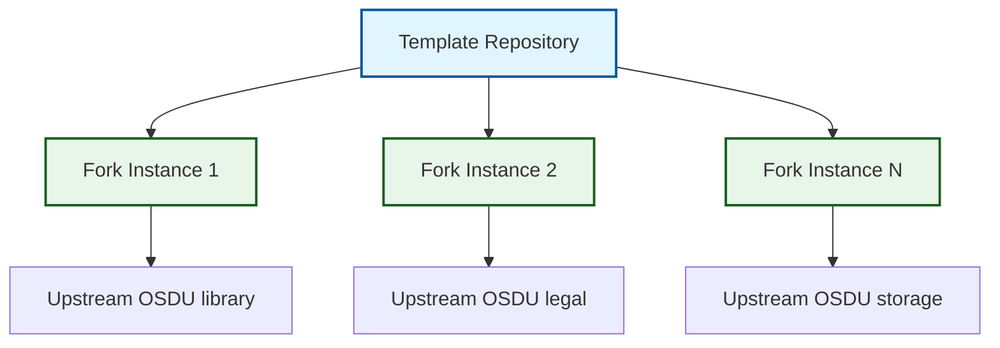

# Overview

## Principles

The system is a GitHub template. A fork created from it gets guided initialization, controlled upstream integration, and ongoing maintenance, all built from GitHub-native workflows, issues, rulesets, releases, and packages.

-   :material-cog-clockwise:{ .lg .middle } **Self Configuring**

    ---

    An initialization issue captures the upstream repository, creates the branch topology, deploys fork workflows, and applies repository settings.

-   :material-shield-check:{ .lg .middle } **Safety First**

    ---

    Each branch stage validates before promoting, backed by rulesets and security scanning.

-   :material-lightning-bolt:{ .lg .middle } **Event Driven**

    ---

    Scheduled, pull-request, push, issue-comment, and manual events drive synchronization, validation, release, and recovery.

-   :material-trending-up:{ .lg .middle } **Scalable**

    ---

    Every fork runs the same workflows, so adding a service repository adds no new patterns.

## System Design

The template repository pattern separates template development from fork operation:

**Template Development Context** is `.github/workflows/`: the template's own CI, initialization, documentation build, and the tests for the update propagation mechanism.

**Fork Instance Context** receives the files from `.github/template-workflows/` as deployed `.github/workflows/`, plus fork-owned configuration, actions, and build assets.

**Event Driven Architecture** means the workflows respond to GitHub events: scheduled events (daily sync), change events (PR validation), and manual dispatch (on-demand sync or cascade).

Two components carry most of the design:

-   :material-source-branch:{ .lg .middle } **Three-Branch Strategy**

    ---

    Isolated conflict resolution and controlled integration from upstream through staging to production environments.

    [:octicons-arrow-right-24: Learn about branch strategy](three_branch_strategy.md)

-   :material-cog-clockwise:{ .lg .middle } **Workflow System**

    ---

    Event-driven automation for synchronization, validation, and release management.

    [:octicons-arrow-right-24: Explore workflow architecture](workflow_system.md)

## Source and Artifact Ownership

The engineering system separates ownership rather than mirroring every upstream file:

- The sync workflow regenerates `fork_upstream` from the upstream tip, retaining shared code while removing provider implementations and upstream deployment assets.
- Azure provider and test source is seeded once, then owned on `main` and `fork_integration`.
- Validation builds `core,azure` by default; provider-less `fork_upstream` builds `core` only.
- The engineering system supplies `build/Dockerfile`, which packages the Azure JAR built from source.
- Trusted validation events publish multi-architecture images to public GHCR; release automation adds the semantic-version tag without rebuilding.

See [ADR-033](../adr/033-ghcr-as-service-image-registry.md), [ADR-035](../adr/035-azure-only-maven-profile.md), [ADR-037](../adr/037-engineering-system-owns-service-dockerfile.md), and [ADR-038](../adr/038-upstream-filter-transform.md).

## Enterprise Capabilities

The system combines repository rulesets, CodeQL, Dependabot validation, trusted-event package publication, and GitHub App authentication. The default-branch ruleset keeps human approval on `main`, the integration-branch ruleset lets automation maintain `fork_upstream` and `fork_integration`, and the Copilot code review ruleset requests a Copilot review on every `main` pull request where the organization supports it. Forks receive centrally maintained workflows and the shared Dockerfile while keeping ownership of their Azure source and filter configuration. A pull request to `main` that changes a file present on `fork_upstream` fails Check Paths unless it carries the `port` label declaring a deliberate port (ADR-038).

---