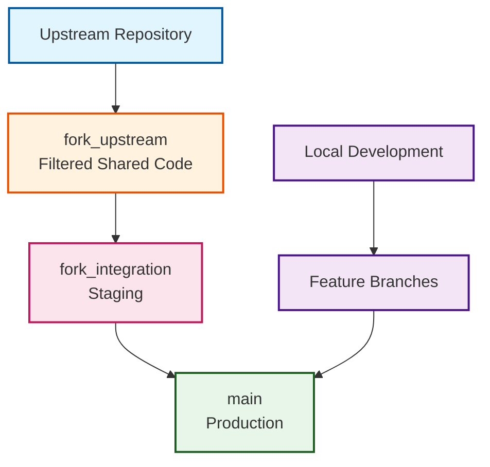
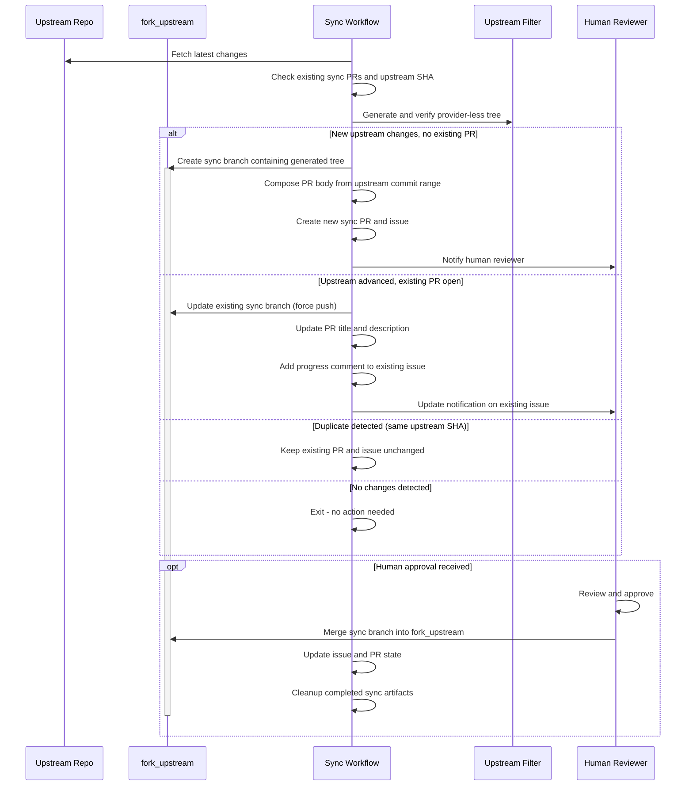
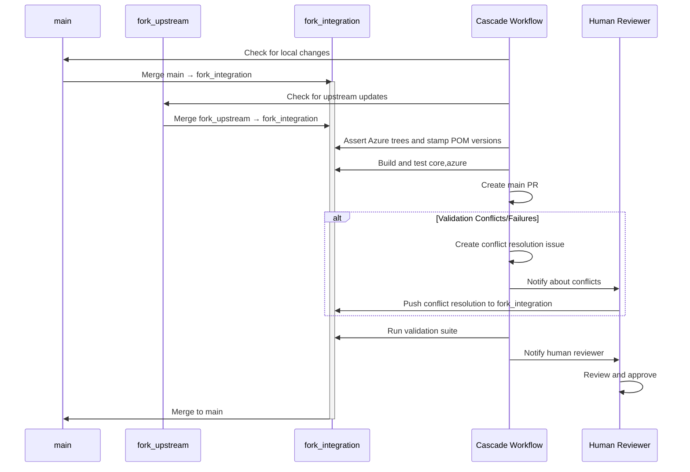
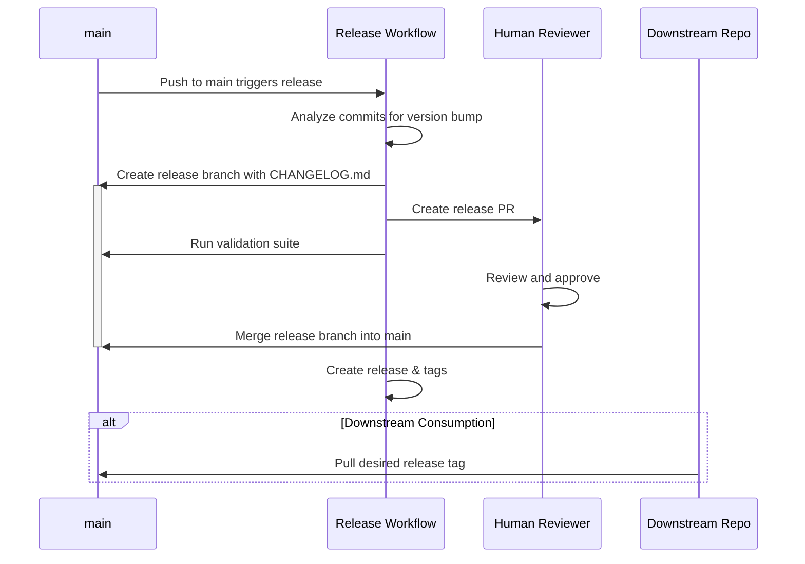

# Three-Branch Strategy

The three-branch strategy gives upstream changes a controlled path into the fork. Each branch is a checkpoint, so a failure stops at the stage where it happened while synchronization continues.

## Branch Architecture

### Branch Purposes

-   :material-source-branch-check:{ .lg .middle } **`main` - Production Branch**

    ---

    Stable production branch containing successfully integrated changes

    - Required PR reviews and status checks
    - Shared and fork-owned Azure code
    - Upstream updates arrive through validated release PRs from `fork_integration`
    - Local feature and hotfix branches also merge through reviewed PRs

-   :material-source-commit:{ .lg .middle } **`fork_upstream` - Generated Upstream Tree**

    ---

    Deterministic upstream-owned tree generated from the upstream tip

    - Keeps shared core, acceptance-test, test-core, POM, documentation, and license content
    - Excludes provider source, `core-plus`, `devops/`, non-Azure tests, and upstream CI files
    - Injects POM references to Azure modules that exist only on the fork-owned branches
    - Halts when new shared content is not classified
    - Filtered from its first generation: initialization generates the branch through the engine, so the fork never carries a verbatim mirror and the Azure trees never enter the merge base

-   :material-source-merge:{ .lg .middle } **`fork_integration` - Integration Workspace**

    ---

    Where conflicts are resolved and the combined tree is validated

    - Relaxed protection so conflict resolution can push directly
    - Combines generated shared code with fork-owned Azure provider and test source
    - Automated merges from `fork_upstream` with conflict resolution
    - Azure POM version stamping plus `core,azure` build and test validation

## Process Flow

#### **Synchronize**

!!! info "Sync State Management"
    The synchronization process tracks the upstream SHA, active PR, and issue state to prevent duplicates. Before creating or updating a sync branch, the upstream filter classifies the upstream tip and halts on unknown shared content. When upstream advances while a PR is open, the existing branch is regenerated and updated.

#### **Integrate**

#### **Release**

A downstream repository does not have to stop at pulling release tags. It can be a customer-tier fork running this same three-branch machinery in mirror mode: `fork_upstream` becomes a verbatim mirror of this repository's `main`, the cascade integrates it with the downstream's local work, and contribution PRs flow back through the fork network. See [Fork Tiers](fork_tiers.md) and ADR-039.

## Safety Mechanisms

### Branch Protection Rules

| Protection Setting | :material-source-branch: *main* | :material-source-branch: *fork_upstream* | :material-source-branch: *fork_integration* |
|-------------------|-------|---------------|------------------|
| **Required Reviews** | 1 minimum | Not required | Not required |
| **Status Checks** | `CodeQL`, `Validation Summary` | Not required | Not required |
| **Up-to-date Branch** | Required | Not enforced | Not enforced |
| **Force Push** | Blocked | Allowed | Allowed |
| **Expected Writers** | Reviewed PRs | Sync automation | Cascade and cleanup automation |

### Quality Gates

!!! check "Integration Validation"
    ✓ **Build Verification**: `core,azure` compilation and dependency resolution
    ✓ **Test Execution**: Unit tests plus compile-only validation of the separate Azure testing reactor
    ✓ **Container Validation**: Canonical Dockerfile build on branches that contain the Azure JAR
    ✓ **Security Scanning**: CodeQL reports through its separate workflow

!!! warning "Production Validation"
    ⚠️ **Human Review**: a reviewer approves every PR to `main`  
    ⚠️ **Release Notes**: Release Please records the change in the changelog

## Workflow Benefits

-   :material-target:{ .lg .middle } **Conflict Isolation**

    ---

    Merge conflicts are resolved in the dedicated `fork_integration` branch, preventing disruption to the stable `main` branch during resolution.

-   :material-magnify:{ .lg .middle } **Clear Change Attribution**

    ---

    Clear separation between generated upstream-owned shared code and fork-owned Azure implementation changes.

-   :material-shield-account:{ .lg .middle } **Multi-Stage Validation**

    ---

    Review and validation at each stage catch problems before they reach `main`.

-   :material-history:{ .lg .middle } **Upstream Tracking**

    ---

    Reproducible filtered commits retain upstream history and record the upstream SHA and filter revision.

-   :material-backup-restore:{ .lg .middle } **Rollback Capability**

    ---

    A bad integration can be reverted on `main` without losing the upstream sync state.

## Operational Patterns

### Daily Synchronization Cycle

**Automated Processing:**

:material-arrow-right: **Step 1:** Check Upstream - Daily automated check for new upstream changes  
:material-arrow-right: **Step 2:** Filter Transform - Regenerate and verify the upstream-owned tree
:material-arrow-right: **Step 3:** Sync Review - Review and merge the filtered PR to `fork_upstream`
:material-arrow-right: **Step 4:** Cascade - Merge into integration, stamp Azure POMs, and run validation

**Human Intervention Points:**

:material-arrow-right: **Step 1:** Sync Review - Merge the sync PR into `fork_upstream`  
:material-arrow-right: **Step 2:** Conflict Resolution - Resolve on `fork_integration` when the cascade merge fails  
:material-arrow-right: **Step 3:** Production Approval - Approve the release PR to `main`  
:material-arrow-right: **Step 4:** Release - Merge the Release Please PR when the version is ready

!!! info "Release Strategy"
    The cascade opens its PR to `main` from a temporary `release/upstream-YYYYMMDD-HHMMSS` branch, which is deleted after merge, so `fork_integration` itself is never the PR head.

---