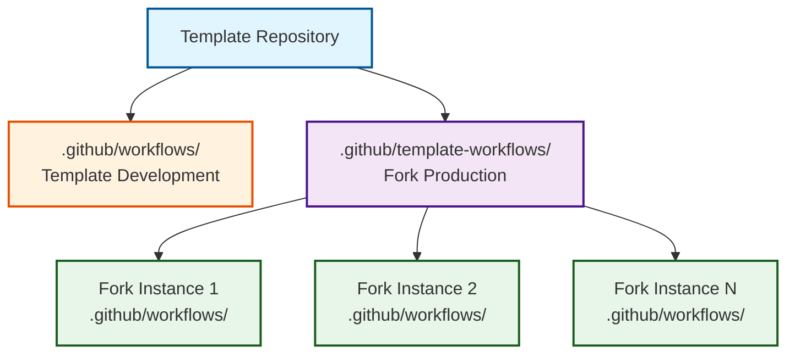
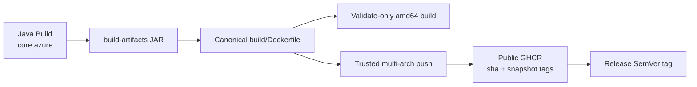
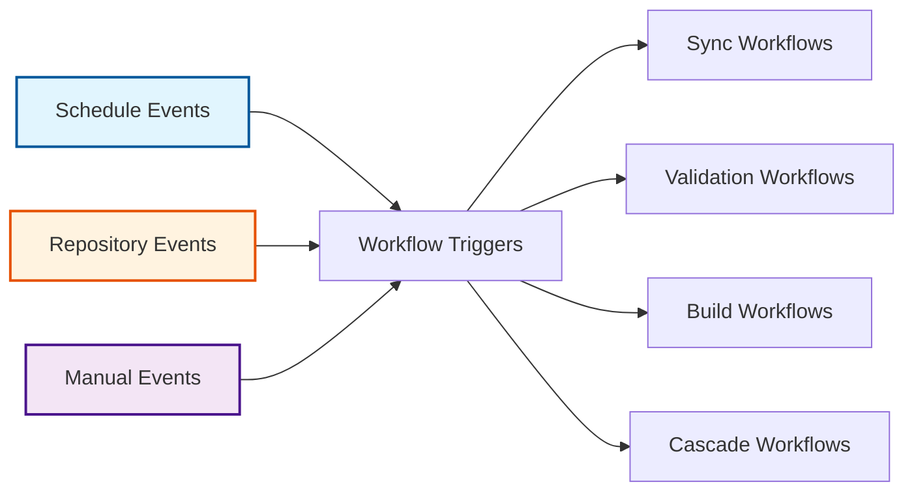

# Workflow System Architecture

The template keeps its own workflows apart from the workflows it deploys to forks. Template changes are developed and tested in one place and propagated to every fork.

## Workflow Architecture Pattern

### Template-Workflows Separation

The two directories serve different repositories:

-   :material-cog:{ .lg .middle } **Template Development Context**

    ---

    **`.github/workflows/` - Template management and maintenance**

    - Repository initialization and bootstrap workflows
    - Template testing and validation workflows
    - Template versioning and release management
    - Development CI/CD pipelines

-   :material-factory:{ .lg .middle } **Fork Production Context**

    ---

    **`.github/template-workflows/` - Production fork operations**

    - Upstream synchronization workflows
    - Build and validation workflows  
    - Release management for fork instances
    - Monitoring and maintenance workflows

## Core Workflow Categories

### :material-sync: Synchronization Workflows

-   :material-sync:{ .lg .middle } **Daily Upstream Sync** (`sync.yml`)

    ---

    Daily synchronization that filters the upstream tip into a reproducible provider-less tree, prevents duplicate PRs, and derives the meta commit and PR body from the upstream commit range

    - **Trigger**: Scheduled daily at midnight UTC, or manual dispatch
    - **Transform**: Keeps shared code, removes provider/deployment source, and injects references to fork-owned Azure modules
    - **Safety**: Halts when shared upstream content is unclassified or an expected kept path disappears
    - **Decision Logic**: Updates existing branches when upstream advances, prevents duplicates for same SHA
    - **Integration**: Three-branch safety pattern (fork_upstream → fork_integration → main)
    - **Classification**: Deterministic bump rule over the upstream range, breaking before feat before fix (ADR-023)

    [:octicons-arrow-right-24: Detailed spec](../workflows/synchronization.md)

-   :material-update:{ .lg .middle } **Template Propagation** (`sync-template.yml`)

    ---

    Brings template changes into a fork as a reviewable PR

    - **Trigger**: Daily scheduled execution at 8 AM UTC
    - **Scope**: The files listed in `sync-config.json`
    - **Duplicates**: One open template-sync PR at a time (ADR-031)

    [:octicons-arrow-right-24: Decision record](../adr/012-template-update-propagation-strategy.md)

### :material-check-circle: Validation Workflows

-   :material-check-circle:{ .lg .middle } **Pull Request Validation** (`validate.yml`)

    ---

    The required checks on every PR to a protected branch

    - **Scope**: Semantic PR titles, branch status, Java build, Dockerfile build, and trusted-event GHCR push
    - **Profiles**: `core,azure` by default; `core` for provider-less `fork_upstream`
    - **Summary checks**: Always report, so a skipped job never leaves a required check pending

    [:octicons-arrow-right-24: Detailed spec](../workflows/validation.md)

-   :material-robot-excited:{ .lg .middle } **Dependabot Automation** (`dependabot-validation.yml`)

    ---

    Dedicated build and image validation for Dependabot pull requests. The planted Dependabot configuration watches only the fork-owned Azure poms, and a bump that still reaches an upstream-owned pom through Maven inheritance is closed with a comment; shared-code bumps arrive through the upstream sync (ADR-038)

    - **Automation**: Runs one reusable Java build with coverage, then validates the service image
    - **Feedback**: The build result is the PR's check; a failure is reported there and nowhere else
    - **Integration**: Keeps automated dependency updates out of the regular validation build lane

    [:octicons-arrow-right-24: Detailed spec](../workflows/validation.md)

### :material-hammer-wrench: Build & Release Workflows

-   :material-hammer-wrench:{ .lg .middle } **Project Build** (`build.yml`)

    ---

    Java/Maven feature-branch build verification with tests, JaCoCo reporting, and short-lived JAR artifacts

    - **Focus**: Rapid developer feedback for feature branch development
    - **Coverage**: Unit tests and JaCoCo report artifacts
    - **Performance**: Maven caching and docs/config path exclusions
    - **Boundary**: Container validation and publication belong to `validate.yml`, not `build.yml`

    [:octicons-arrow-right-24: Detailed spec](../workflows/build.md)

-   :material-tag:{ .lg .middle } **Semantic Release** (`release.yml`)

    ---

    Automated semantic versioning with conventional commit analysis, changelog generation, and coordinated release distribution

    - **Versioning**: Release Please integration with conventional commit standards
    - **Coordination**: Upstream version tracking and alignment strategies
    - **Documentation**: Automated changelog and release notes generation
    - **Distribution**: Upstream correlation tags and registry-side SemVer tagging of the existing GHCR image

    [:octicons-arrow-right-24: Detailed spec](../workflows/release.md)

### :material-water-outline: Cascade Workflows

-   :material-water-outline:{ .lg .middle } **Integration Cascade** (`cascade.yml`)

    ---

    Promotes a merged sync from `fork_upstream` through `fork_integration` to a PR on `main`

    - **Flow**: fork_upstream → fork_integration → main
    - **Validation**: Build and test `core,azure` on `fork_integration` before opening the PR
    - **Trigger**: Dispatched by the monitor, or manually with the sync issue number
    - **Tracking**: Progress comments on the sync issue

    [:octicons-arrow-right-24: Detailed spec](../workflows/cascade.md)

-   :material-monitor-eye:{ .lg .middle } **Cascade Monitoring** (`cascade-monitor.yml`)

    ---

    Monitoring system that detects completed synchronizations and dispatches cascade or recovery operations

    - **Detection**: Automated monitoring for completed upstream synchronizations
    - **Schedule**: Six-hour safety-net checks for missed events and stale conflicts
    - **Escalation**: Labels and comments on cascades that stay blocked
    - **Recovery**: Retries failure issues after maintainers mark them ready

    [:octicons-arrow-right-24: Detailed spec](../workflows/cascade.md)

## Service Image Lifecycle

The engineering system owns the Dockerfile and entrypoint. The Docker action packages the JAR produced by the Java job; it never runs Maven or downloads the service's own binary. Untrusted PR validation has no registry credentials. Trusted events publish `linux/amd64` and `linux/arm64` images to public GHCR, and release automation retags the immutable release-commit image.

## Workflow Event Architecture

### Event-Driven Triggers

| Trigger Type | Workflow | Schedule/Event | Description |
|-------------|----------|----------------|-------------|
| **Scheduled** | Daily Sync | `0 0 * * *` | Midnight UTC upstream synchronization with duplicate prevention |
| **Scheduled** | Template Sync | `0 8 * * *` | Daily 8 AM UTC template updates with duplicate prevention |
| **Scheduled** | Monitoring | `0 */6 * * *` | 6-hour cascade monitoring |
| **Event-Based** | PR Validation | PR creation/updates | Validation workflows on pull requests |
| **Event-Based** | Cascade Monitor | Sync PR merged | Dispatches cascade after merge to `fork_upstream` |
| **Event-Based** | Build | Feature push or protected-branch PR | Java developer feedback |
| **Event-Based** | Release | Push to `main` | Release Please and GHCR SemVer tagging |
| **Manual** | Sync | On-demand | Immediate upstream synchronization |
| **Manual** | Cascade | On-demand | Cascade for a given sync issue |
| **Manual** | Template Sync | On-demand | Immediate template propagation |

## Workflow Integration Patterns

### Deterministic Descriptions

-   :material-file-document:{ .lg .middle } **Workflow-Owned Bodies**

    ---

    PR bodies and commit classification are computed from git, with no model and no external
    service. The same commit range always produces the same output. See ADR-014 (superseded)
    for why the previous AI path was removed.

Each sync computes, from git alone:

- **Commit list**: the upstream range not yet reachable from `fork_upstream`, capped for GitHub's body limit
- **Meta commit**: a conventional subject chosen by rule (breaking, then feat, then fix), with non-conventional upstream commits falling through to `fix:` (ADR-023)
- **Regeneration**: a sync carrying no new upstream commits says so and names the filter revision

### Security Integration

Security responsibilities are split across CodeQL, Dependabot validation, repository rulesets, pinned actions, and trusted-event package permissions.

-   :material-shield-search:{ .lg .middle } **Automated Security Scanning**

    ---

    - CodeQL analysis with a stable required summary check
    - Dependabot update validation
    - Registry writes restricted to trusted events
    - Pinned third-party workflow actions

-   :material-shield-check:{ .lg .middle } **Branch Protection Integration**

    ---

    - Required status checks before merge
    - Human approval for every PR to `main`
    - No direct pushes to `main`

## Workflow State Management

### Issue-Based Tracking

#### **Lifecycle Management**
Each sync opens a tracking issue. The sync, cascade, and monitor workflows comment on it as they progress, and failures open a `human-required` issue with the error and the steps to recover.

#### **Label-Based Organization**
- **Workflow Types**: `upstream-sync`, `template-sync`, `release-tracking`
- **Status Indicators**: `cascade-active`, `cascade-blocked`, `validation-failed`
- **Priority and recovery**: `high-priority`, `cascade-ready`, `needs-resolution`
- **Assignment Strategy**: `human-required` for manual intervention points

### Caching and Concurrency

Maven dependencies and Docker layers are cached between runs. JAR and coverage artifacts live for two days. Sync, cascade, and deployment run under concurrency groups so two runs never touch the same branch at once.

## Reusable Actions

- **Java Build**: Maven build, tests, coverage, and JAR artifacts
- **Docker Build**: Canonical image build and trusted GHCR publication
- **Upstream Filter**: Generate, verify, seed, and stamp modes
- **State and PR Status**: Duplicate prevention and workflow feedback

---