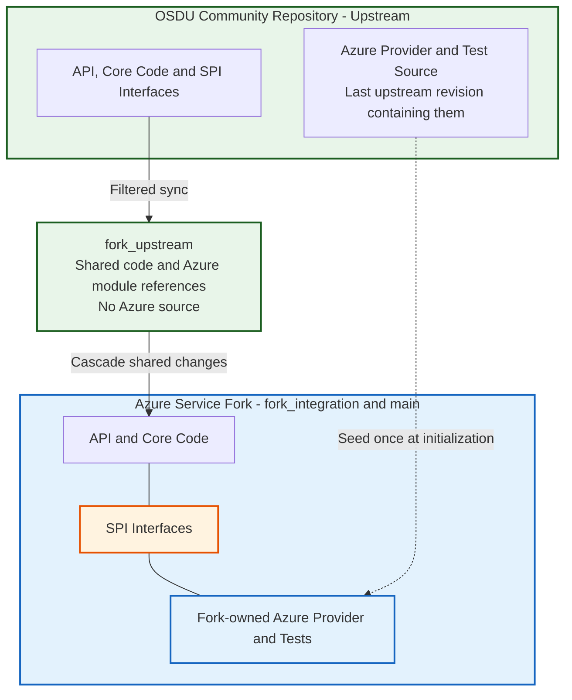
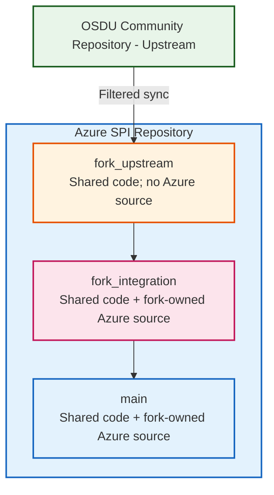

# Concepts

A cloud provider running the Open Subsurface Data Universe (OSDU) has to keep two things at once: compatibility with the community code, and its own Service Provider Interface (SPI) implementation. OSDU keeps community standards and cloud-specific code in separate layers. The diagram below shows how Microsoft keeps that separation through a fork:

The **SPI Interface** (orange) is the code boundary: shared service logic calls an interface implemented by the Azure provider. Source ownership follows a separate boundary. Sync regenerates `fork_upstream` from shared upstream code and injects references to the Azure modules, but excludes the provider implementations themselves.

Upstream plans to remove its Azure implementations. Initialization therefore seeds `provider/<svc>-azure` and `testing/<svc>-test-azure` once, from the newest upstream revision that still contains them. Those trees are then maintained in the service fork on `fork_integration` and `main`. Cascade combines shared changes with that fork-owned source and updates its Maven version wiring. Late upstream fixes to Azure source need an explicit port. See [ADR-038: Upstream Filter Transform and One-Time Azure Seeding](adr/038-upstream-filter-transform.md).

:material-open-source-initiative: **Upstream-Owned Components** include OSDU core interfaces, community-validated business logic, standard data models, and shared tests.

:material-microsoft-azure: **Fork-Owned Components** include the Azure provider and Azure test source, plus the fork's engineering configuration and build machinery.

## The Fork Management Problem

A long-lived fork of an upstream OSDU repository runs into four recurring problems:

  

:material-merge: **Integration Complexity**

Manual synchronization is slow, and slowest when an upstream change touches an interface the Azure SPI implementation depends on.
  

  

:material-source-branch-sync: **Divergence Risk**

Local modifications drift from upstream over time, and each sync gets harder than the last.
  

  

:material-block-helper: **Blocking Dependencies**

In a shared tree, a build or test failure in any provider's SPI implementation can block merging changes for every other provider.
  

  

:material-source-repository-multiple: **Release Coordination**

Without tracking, nobody can say which upstream release a fork version contains.
  

| Aspect | Manual Fork Management | This System |
|--------|----------------------------|-------------------|
| **Synchronization** | Weekly or monthly, by hand | Daily, as a reviewable PR |
| **Conflict Resolution** | Wherever the merge happened | Isolated in `fork_integration` |
| **Release Coordination** | Tracked by hand, if at all | Correlation tags against upstream releases |
| **Integration Testing** | After conflicts are resolved | At each branch stage |

## The Automation Solution

The system isolates each stage of integration in its own branch. Changes flow through `fork_upstream`, then `fork_integration`, then `main`, with validation at each step, so a failure stops at the stage where it happened.

**What the workflows do:**

  

:material-sync: **Upstream Synchronization**

- Daily pull of the upstream tip
- Generated from shared upstream code, with Azure module references but no Azure source
- One PR per upstream state, with the commit list in the body
  

  

:material-source-merge: **Conflict Management**

- Resolution happens in `fork_integration`
- A tracking issue records the conflict and the steps to resolve it
- Build and tests run before the change is offered to `main`
  

  

:material-tag-multiple: **Release Coordination**

- Correlation tags against upstream versions
- Semantic versions computed from conventional commits
- Changelog generated by Release Please
  

**The model extends one tier further.** A customer organization can run a true GitHub fork of a service repository through this same machinery in mirror mode: their `fork_upstream` mirrors the service repository's `main` verbatim, they build and release with their own credentials, and proven features return as contribution PRs through the fork network. See [Fork Tiers](architecture/fork_tiers.md).

## Why This Matters

The fork team spends its time on the Azure implementation instead of on merges. Upstream changes arrive as reviewable PRs on a predictable cadence, releases record which upstream version they contain, and downstream systems such as Azure Data Manager for Energy get stable release points to consume.

---
