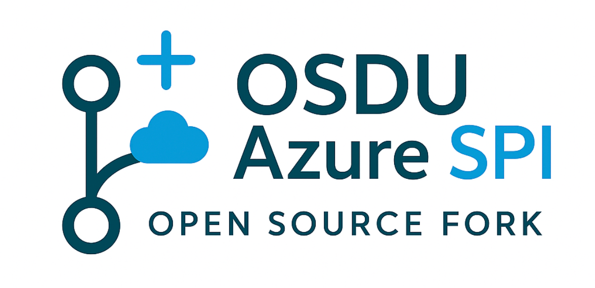

  

    
    
Automation for maintaining long-lived forks

  

## The Challenge

A long-lived fork of an OSDU service has to take upstream changes continuously while keeping its own provider implementation. Done by hand, that means recurring merge conflicts, releases that lag upstream, and forks that drift from the community code.

## The Solution

A template repository that gives each fork the same set of workflows:

  

:material-merge: **Upstream Synchronization**

A daily sync generates a provider-less copy of the upstream tip and opens one reviewable PR per upstream state.
  

  

:material-source-branch: **Three-Branch Strategy**

Changes flow from `fork_upstream` through `fork_integration` to `main`, so conflicts and build failures are resolved before they reach production.
  

  

:material-source-merge: **Deterministic Releases**

PR bodies, version bumps, and changelogs are computed from the commit history, so the same input always produces the same release.
  

  

:material-shield-check: **Security by Default**

CodeQL, Dependabot validation, repository rulesets, and GitHub App authentication are configured during initialization.
  

## What You Get

:material-check-circle: One sync PR per upstream state, never a pile of duplicates  
:material-check-circle: Conflicts surface in `fork_integration`, not on `main`  
:material-check-circle: Releases correlated with the upstream version they contain  
:material-check-circle: Initialization driven by a single issue reply  

---