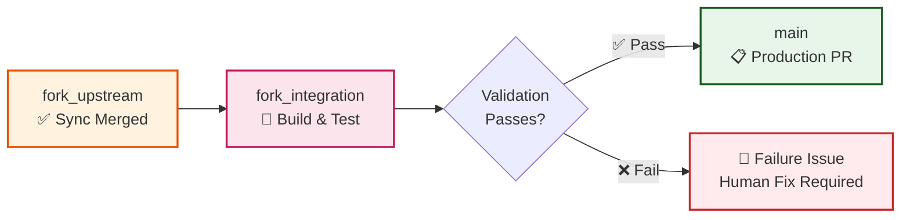

# Cascade Integration Workflow

The cascade is the second phase of fork management. After a sync PR merges into `fork_upstream`, the cascade integrates the change through `fork_integration` and offers it to `main`.

This workflow acts as a quality gate, running the Azure Maven build and tests before allowing changes to reach `main`. It combines the generated, provider-less upstream tree with the fork-owned Azure implementation and verifies that the result works.

The cascade process includes a dedicated monitor workflow. A merged sync PR triggers the monitor immediately, while a 6-hour schedule detects missed events, stale conflicts, and recovery-ready failures.

## When It Runs

The cascade workflow starts on:

- **Manual trigger** - You provide the sync issue number in the GitHub Actions tab after reviewing a sync PR
- **Automatic trigger** - The monitor dispatches the cascade when a sync PR is merged
- **Scheduled recovery** - The monitor checks every 6 hours for missed or recoverable cascades

## What Happens

The workflow:

1. **Validates sync completion** - Ensures the upstream sync PR was properly merged and prerequisites are met
2. **Builds the integration state** - Merges `main` and then `fork_upstream` into `fork_integration`
3. **Preserves Azure ownership** - Verifies the fork-owned Azure provider and test trees remain present
4. **Stamps Azure versions** - Updates upstream-derived versions in the fork-owned POMs after an upstream version bump
5. **Runs validation** - Builds and tests `core,azure`, then compiles the separate core and Azure testing reactor
6. **Creates production PR** - Opens a temporary `release/upstream-*` PR to `main`
7. **Provides status updates** - Comments on the original sync issue with progress reports and next steps

## Three-Branch Progression



On success a PR to `main` is open and waiting for review. On failure a dedicated issue records the error and the recovery steps.

## When You Need to Act

### Automatic Triggers
- **Monitor dispatch** - A merged sync PR starts the cascade through the monitor
- **Validation failures** - A dedicated issue records errors and recovery steps

### Manual Actions
- **After sync PR merge** - Trigger cascade with the sync issue number if the monitor did not
- **Integration conflicts** - Resolve conflicts in `fork_integration` branch
- **Production PR review** - Final approval before merge to `main`

## How to Respond

### Manual Cascade Trigger
1. **Find sync issue number** - From completed upstream sync
2. **Go to Actions** → "Cascade Integration" workflow
3. **Click "Run workflow"** → Enter issue number → Run
4. **Monitor progress** - Watch for completion or error comments

### Handle Integration Conflicts
```bash
# Checkout integration branch
git checkout fork_integration
git status  # See conflict files

# Resolve conflicts
# ... resolve using IDE or manual editing ...

# Test and push
mvn test
git add .
git commit -m "resolve: integration conflicts"
git push origin fork_integration
```

### Review Production PR
1. **Validate changes** - Ensure integration preserved your fork modifications
2. **Check test results** - All validation must pass
3. **Approve and merge** - Final step to production

## Configuration

| Setting | Default | Description |
|---------|---------|-------------|
| **Monitor Schedule** | Every 6 hours | Automatic detection of stalled sync PRs |
| **Validation Process** | `core,azure` build + tests | `MAVEN_PROFILE` can override exceptional layouts |
| **Auto-merge Production** | Armed when possible | Waits for the required human approval on `main` |
| **Integration Conflicts** | Manual resolution | Human intervention required for conflicts |
| **Failure Handling** | Create dedicated issue | Automatic issue creation with resolution steps |

## Troubleshooting

| Issue | Solution |
|-------|----------|
| "Invalid sync issue number" | Verify issue exists and is upstream sync type |
| "Sync PR not merged" | Complete upstream sync process first |
| "Integration conflicts" | Resolve conflicts in `fork_integration` branch |
| "Validation failed" | Check PR comments for specific test/build failures |
| "Production merge blocked" | Ensure all status checks pass |

## Safety Features

- **Three-branch isolation** - Failures don't affect `main` branch
- **Validation** - `core,azure` build and tests on the merged tree
- **Fork-owned path assertion** - Fails if the Azure provider or test tree disappears
- **Version stamping** - Aligns fork-owned Azure POMs with new upstream coordinates
- **Human approval gates** - Production changes require explicit review
- **Audit trail** - Every step is commented on the sync issue

## Related

- [Synchronization Workflow](synchronization.md) - Previous step in process
- [Validation Workflow](validation.md) - Details on quality checks
- [Three-Branch Strategy](../adr/001-three-branch-strategy.md) - Core architecture
- [ADR-038: Upstream Filter Transform](../adr/038-upstream-filter-transform.md) - Ownership and version-stamping model