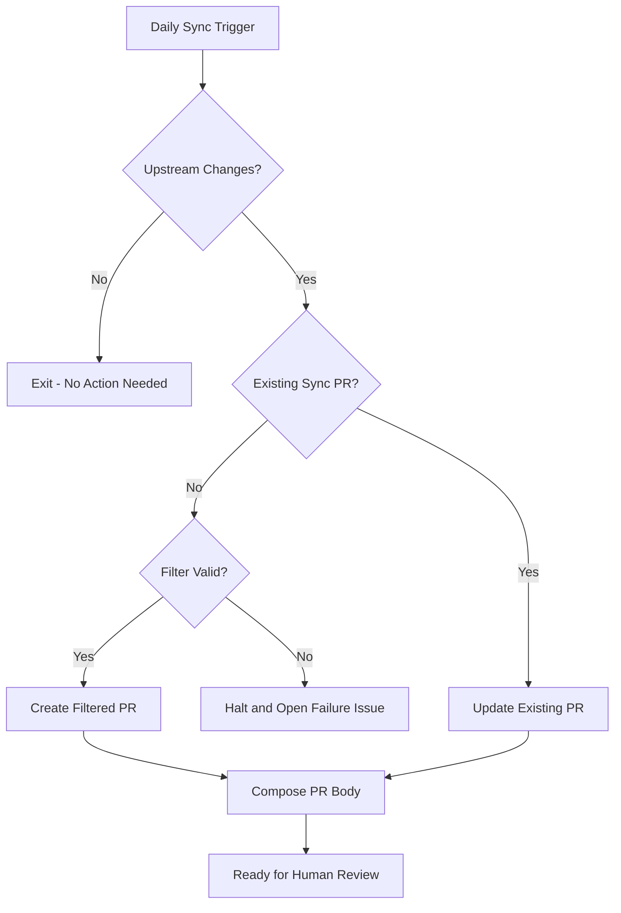

# Upstream Synchronization Workflow

The upstream synchronization workflow keeps the fork's shared service code synchronized with the upstream OSDU repository. It does not mirror the upstream tree: it deterministically generates the provider-less `fork_upstream` tree defined by the fork's filter configuration.

Only one sync PR exists at a time. When upstream changes, the workflow either creates a new sync PR or updates the open one.

The transform avoids recurring modify/delete conflicts by excluding provider source before a sync branch is created. If upstream introduces unclassified shared content, the filter halts rather than guessing and opens a `sync-failed,human-required` issue.

## When It Runs

The synchronization workflow runs on:

- **Daily at midnight UTC** - Scheduled automatic sync to catch upstream changes
- **Manual trigger** - Run on-demand via the GitHub Actions tab when needed

## What Happens

The workflow:

1. **Fetches upstream** - Resolves the upstream `main` or `master` tip
2. **Generates a filtered tree** - Keeps shared code, removes provider and `devops/` source, and injects references to fork-owned Azure modules
3. **Verifies classification** - Halts on unknown shared modules or missing expected paths
4. **Creates or updates a sync branch** - Serializes the generated tree as a merge-shaped commit without checking out `fork_upstream`
5. **Generates a PR** - Body is computed from the upstream commit range, capped so it stays within GitHub's body limit
6. **Creates a tracking issue** - Links the PR with `human-required` and `upstream-sync` labels
7. **Waits for human review** - The team merges the PR into `fork_upstream` to continue the cascade

## Duplicate Prevention

The workflow tracks the upstream SHA and the open sync PR to avoid duplicates:

| Situation | Action Taken |
|-----------|-------------|
| **No existing PR + upstream changed** | Creates new PR and tracking issue |
| **Existing PR + upstream unchanged** | Keeps the existing PR and issue unchanged |
| **Existing PR + upstream changed** | Updates existing PR with new changes |
| **No existing PR + upstream unchanged** | No action - exits cleanly |

An upstream commit that touches only filtered paths (a non-Azure provider,
`devops/`, `.gitlab-ci.yml`) advances the upstream tip without changing the
fork's tree. That run opens nothing and records the evaluated commit in the
`SYNC_LAST_EVALUATED_SHA` repository variable, so later runs skip it instead of
regenerating an identical tree every night. While a sync PR is open its
tracking issue remains the source of truth.

## Upstream Filter Transform

The transform separates source ownership:

| Ownership | Contents |
|-----------|----------|
| **Upstream-owned** | Shared core and acceptance-test code, core tests, root/testing POMs, docs, notices, licenses, and Maven configuration |
| **Removed** | Provider source, `core-plus`, `devops/`, non-Azure tests, and upstream CI files |
| **Fork-owned** | Azure provider and Azure test source, `.github/`, and the canonical `build/` assets |

The fork-owned Azure trees live on `main` and `fork_integration`; they are deliberately absent from `fork_upstream`. The per-service `.github/upstream-filter.yml` classifies upstream content. Initialization plants it from the template's `.github/fork-resources/upstream-filter.yml` with `<service>` substitution, and it is fork-owned from then on. A new unclassified shared module stops the sync so maintainers can explicitly keep or remove it.

## Workflow Outcomes

The workflow produces different outcomes based on what it discovers:
- **Filtered changes**: Creates a PR containing only the generated upstream-owned tree
- **Filter halt**: Opens or updates a failure issue when upstream content is not classified
- **Existing PR updates**: Updates the existing sync PR rather than creating duplicates

## When You Need to Act

Look for `human-required,upstream-sync` issues for sync PR review and `human-required,sync-failed` issues for filter halts:

- **Clean sync** - Review the upstream change list and merge PR if changes look safe
- **Filter halt** - Update `.github/upstream-filter.yml` on `main`, then rerun sync

## How to Respond

### For Clean Syncs
1. **Review the PR** - Check the upstream change list, following the linked upstream merge requests where the change is not obvious
2. **Verify compatibility** - Ensure no breaking changes for your fork
3. **Merge PR** - Approve and merge to `fork_upstream` branch
4. **Monitor cascade** - The cascade monitor dispatches automatically; run "Cascade Integration" manually with the issue number only if that dispatch fails

### For Filter Halts
1. Open the `sync-failed,human-required` issue and note the halt code and path.
2. Classify the new or renamed upstream entry in `.github/upstream-filter.yml` on `main`.
3. Run the upstream-filter harness if the engine or classification rules changed.
4. Rerun the synchronization workflow.

## Configuration

| Setting | Default | Description |
|---------|---------|-------------|
| **Schedule** | `0 0 * * *` | Daily at midnight UTC |
| **Duplicate Prevention** | Enabled | Prevents multiple PRs for same upstream state |
| **Monitor Trigger** | 6 hours | Auto-cascade if human trigger missed |
| **State Persistence** | Issues and open PRs | Tracks the active upstream SHA and sync branch |
| **Filter Configuration** | `.github/upstream-filter.yml` | Explicit per-service classification |

## Troubleshooting

| Issue | Cause | Solution |
|-------|-------|----------|
| "No upstream changes detected" | Fork is current with upstream | Normal - no action needed |
| "Failed to fetch upstream" | Network issues or incorrect URL | Verify the `UPSTREAM_REPO_URL` variable |
| "Duplicate PR detected" | Existing sync PR found | Updates existing PR instead |
| "Cascade not triggered" | Forgot to run manually | Monitor auto-triggers after 6 hours |
| "Upstream filter halted" | New or renamed content is unclassified | Update `.github/upstream-filter.yml` and rerun |

## Related

- [Three-Branch Strategy](../adr/001-three-branch-strategy.md) - Core branching approach
- [Cascade Workflow](cascade.md) - Next step after sync PR is merged
- [Conflict Management](../adr/005-conflict-management.md) - Detailed resolution guidance
- [ADR-038: Upstream Filter Transform](../adr/038-upstream-filter-transform.md) - Filter ownership and halt behavior