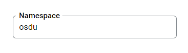

# Service Configuration for Google Cloud

## Table of Contents <a name="TOC"></a>

* [Environment variables](#Environment-variables)
* [Common properties for all environments](#Common-properties-for-all-environments)
* [For Mappers to activate drivers](#For-Mappers-to-activate-drivers)
* [Datastore configuration](#Datastore-configuration)
* [Pubsub configuration](#Pubsub-configuration)
* [Google Cloud service configuration](#ObjectStoreConfig)
* [Google loud service account configuration](#Google-cloud-service-account-configuration)
* [License](#License)
## Environment variables

Define the following environment variables.

Must have:

| name                            | value                                                             | description                                                                     | sensitive? | source |
|---------------------------------|-------------------------------------------------------------------|---------------------------------------------------------------------------------|------------|--------|
| `SPRING_PROFILES_ACTIVE`        | ex `gcp`                                                          | Spring profile that activate default configuration for Google Cloud environment | false      | -      |
| `STORAGE_SERVICE_ACCOUNT_EMAIL` | `workload-storage-gc@nice-etching-277309.iam.gserviceaccount.com` | Storage service account email, used during OQM events processing                | no         | -      |

Defined in default application property file but possible to override:

| name                              | value                                        | description                         | sensitive? | source        |
|-----------------------------------|----------------------------------------------|-------------------------------------|------------|---------------|
| `MANAGEMENT_ENDPOINTS_WEB_BASE`   | ex `/`                                       | Web base for Actuator               | no         | -             |
| `MANAGEMENT_SERVER_PORT`          | ex `8081`                                    | Port for Actuator                   | no         | -             |

### Common properties for all environments

| name                                       | value                                         | description                                                                           | sensitive? | source                                                       |
|--------------------------------------------|-----------------------------------------------|---------------------------------------------------------------------------------------|------------|--------------------------------------------------------------|
| `LOG_PREFIX`                               | `storage`                                     | Logging prefix                                                                        | no         | -                                                            |
| `SERVER_SERVLET_CONTEXPATH`                | `/api/storage/v2/`                            | Servlet context path                                                                  | no         | -                                                            |
| `AUTHORIZE_API`                            | ex `https://entitlements.com/entitlements/v1` | Entitlements API endpoint                                                             | no         | output of infrastructure deployment                          |
| `LEGALTAG_API`                             | ex `https://legal.com/api/legal/v1`           | Legal API endpoint                                                                    | no         | output of infrastructure deployment                          |
| `PUBSUB_SEARCH_TOPIC`                      | ex `records-changed`                          | PubSub topic name                                                                     | no         | <https://console.cloud.google.com/cloudpubsub/topic>         |
| `REDIS_STORAGE_HOST`                       | ex `127.0.0.1`                                | Redis host for storage                                                                | no         |                                                              |
| `REDIS_STORAGE_PASSWORD`                   | ex `*****`                                    | Redis storage host password                                                           | yes        |                                                              |
| `REDIS_STORAGE_WITH_SSL`                   | ex `true` or `false`                          | Redis storage host ssl config                                                         | no         |                                                              |
| `REDIS_STORAGE_EXPIRATION`                 | ex `30`                                       | Redis storage cache expiration in seconds                                             | no         |                                                              |
| `POLICY_API`                               | ex `http://localhost:8080/api/policy/v1/`     | Police service endpoint                                                               | no         | output of infrastructure deployment                          |
| `POLICY_ID`                                | ex `storage`                                  | policeId from ex `http://localhost:8080/api/policy/v1/policies`. Look at `POLICY_API` | no         | -                                                            |
| `PARTITION_API`                            | ex `http://localhost:8081/api/partition/v1`   | Partition service endpoint                                                            | no         | -                                                            |
| `GOOGLE_APPLICATION_CREDENTIALS`           | ex `/path/to/directory/service-key.json`      | Service account credentials, you only need this if running locally                    | yes        | <https://console.cloud.google.com/iam-admin/serviceaccounts> |
| `PARTITION_PROPERTIES_STORAGE_BUCKET_NAME` | ex `storage.bucket.name`                      | Name of partition property for storage bucket name value                              | yes        | -                                                            |
| `SYSTEM_PARTITION_ID`                      | ex `system`                                   | System partition ID                                                                   |

These variables define service behavior, and are used to switch between `Reference` or `Google Cloud` environments, their overriding and usage in mixed mode was not tested.
Usage of spring profiles is preferred.

| name                     | value                     | description                                                                                                               | sensitive? | source |
|--------------------------|---------------------------|---------------------------------------------------------------------------------------------------------------------------|------------|--------|
| `PARTITION_AUTH_ENABLED` | ex `true` or `false`      | Disable or enable auth token provisioning for requests to Partition service                                               | no         | -      |
| `OQMDRIVER`              | `rabbitmq` or `pubsub`    | Oqm driver mode that defines which message broker will be used                                                            | no         | -      |
| `OSMDRIVER`              | `datastore` or `postgres` | Osm driver mode that defines which KV storage will be used                                                                | no         | -      |
| `OBMDRIVER`              | `gcs` or `minio`          | Obm driver mode that defines which object storage will be used                                                            | no         | -      |
| `SERVICE_TOKEN_PROVIDER` | `GCP` or `OPENID`         | Service account token provider, `GCP` means use Google service account `OPEIND` means use OpenId provider like `Keycloak` | no         | -      |

### For Mappers to activate drivers

| name      | value     | description                                             |
|-----------|-----------|---------------------------------------------------------|
| OSMDRIVER | datastore | to activate **OSM** driver for **Google Datastore**     |
| OSMDRIVER | postgres  | to activate **OSM** driver for **PostgreSQL**           |
| OBMDRIVER | gcs       | to activate **OBM** driver for **Google Cloud Storage** |
| OBMDRIVER | minio     | to activate **OBM** driver for **MinIO**                |
| OQMDRIVER | pubsub    | to activate **OQM** driver for **Google PubSub**        |
| OQMDRIVER | rabbitmq  | to activate **OQM** driver for **Rabbit MQ**            |

## Datastore configuration

There must be a namespace for each tenant, which is the same as the tenant name.

Example:




| name                   | value            | description                                               |
|------------------------|------------------|-----------------------------------------------------------|
| DATASTORE_BETA_ENABLED | 'true' or 'false | to activate experimental features in Datastore OSM driver |

```yaml
indexes:
  
- kind: StorageRecord
  ancestor: no
  properties:
    - name: status
      direction: asc
    - name: kind
      direction: asc
```


## PubSub configuration

At PubSub should be created set of topics and subscriptions.

| topic name                         | subscription name               | description                                                                                                                                                                                                                                                            | sensitive? | env var to override                                                     |
|------------------------------------|---------------------------------|------------------------------------------------------------------------------------------------------------------------------------------------------------------------------------------------------------------------------------------------------------------------|------------|-------------------------------------------------------------------------|
| `records-changed`                  | -                               | Search topic for pushing                                                                                                                                                                                                                                               | yes        | `PUBSUB_SEARCH_TOPIC`                                                   |
| `legaltags-changed`                | `storage-oqm-legaltags-changed` | Legaltags topic for consuming <br/> `Maximum delivery attempts: 5`<br/>`Retry policy: Retry after exponential backoff delay`<br/>`Minimum backoff duration: 10 seconds`<br/>`Maximum backoff duration: 600 seconds`<br/>`Grant forwarding permissions for dead letter` | yes        | `LEGAL_TAGS_CHANGED_TOPIC_NAME`, `LEGAL_TAGS_CHANGED_SUBSCRIPTION_NAME` |
| `legal-tag-changed-dead-lettering` | -                               | -                                                                                                                                                                                                                                                                      | -          | -                                                                       |

## GCS configuration <a name="ObjectStoreConfig"></a>

### Per-tenant buckets configuration

These buckets must be defined in tenants’ “data” Google Cloud projects that names are pointed in tenants’ PartitionInfo registration objects’ “projectId” property at the Partition service.

<table>
  <tr>
   <td>Bucket Naming template
   </td>
   <td>Permissions required
   </td>
  </tr>
  <tr>
   <td>&lt;PartitionInfo.projectId-PartitionInfo.name><strong>-records</strong>
   </td>
   <td>ListObjects, CRUDObject
   </td>
  </tr>
</table>

We can use Partition Service to get a bucket name:

```
curl -L -X PATCH 'https:///api/partition/v1/partitions/opendes' -H 'data-partition-id: opendes' -H 'Authorization: Bearer ...' -H 'Content-Type: application/json' --data-raw '{
  "properties": {
    "partition.properties.storage.bucket.name": {
      "sensitive": true,
      "value": "PARTITION_PROPERTIES_STORAGE_BUCKET_NAME"
    }
  }
}'

```


## Google Cloud service account configuration

TBD

| Required roles |
|----------------|
| -              |

### Running E2E Tests

You will need to have the following environment variables defined.

| name                      | value                                          | description                                                                                                                      | sensitive? | source                                                       |
|---------------------------|------------------------------------------------|----------------------------------------------------------------------------------------------------------------------------------|------------|--------------------------------------------------------------|
| `DEPLOY_ENV`              | `empty`                                        | Required but not used, should be set up with string "empty"                                                                      | no         | -                                                            |
| `GROUP_ID`                | ex`opendes-gc.projects.com`                    | OSDU R2 to run tests under                                                                                                       | no         | -                                                            |
| `INTEGRATION_TESTER`      | `ewogICJ0....` or `tmp/service-acc.json`       | Service account base64 encoded string or path to a file for API calls. Note: this user must have entitlements configured already | yes        | <https://console.cloud.google.com/iam-admin/serviceaccounts> |
| `LEGAL_URL`               | ex`http://localhsot:8080/api/legal/v1/`        | Legal API endpoint                                                                                                               | no         | -                                                            |
| `NO_DATA_ACCESS_TESTER`   | `ewogICJ0....` or `tmp/service-acc.json`       | Service account base64 encoded string or path to a file without data access                                                      | yes        | <https://console.cloud.google.com/iam-admin/serviceaccounts> |
| `PUBSUB_TOKEN`            | `****`                                         | ?                                                                                                                                | no         | -                                                            |
| `STORAGE_URL`             | ex`http://localhost:8080/api/storage/v2/`      | Endpoint of storage service                                                                                                      | no         | -                                                            |
| `TENANT_NAME`             | ex `opendes`                                   | OSDU tenant used for testing                                                                                                     | no         | --                                                           |
| `OPA_INTEGRATION_ENABLED` | `true` OR `false`                              | Should be update if integration with OPA\Policy enabled\disabled                                                                 | no         | --                                                           |
| `ENTITLEMENTS_URL`        | ex`http://localhost:8080/api/entitlements/v2/` | Endpoint of entitlements service                                                                                                 | no         | -                                                            |
| `DATA_ROOT_TESTER`        | `********`                                     | Service account base64 encoded string with data root access                                                                      | yes        | <https://console.cloud.google.com/iam-admin/serviceaccounts> |


**Entitlements configuration for integration accounts**

| INTEGRATION_TESTER                                                                                                                                                                                                                            | NO_DATA_ACCESS_TESTER                                         | DATA_ROOT_TESTER                                                                                           |
|-----------------------------------------------------------------------------------------------------------------------------------------------------------------------------------------------------------------------------------------------|---------------------------------------------------------------|------------------------------------------------------------------------------------------------------------|
| users<br/>service.entitlements.user<br/>service.entitlements.admin<br/>service.storage.admin<br/>service.storage.creator<br/>service.storage.viewer<br/>service.legal.admin<br/>service.legal.editor<br/>data.test1<br/>data.integration.test | users<br/>service.entitlements.user<br/>service.storage.admin | users<br/>users.data.root<br/>service.entitlements.user<br/>service.storage.admin<br/>service.legal.viewer |

Execute following command to build code and run all the integration tests:

 ```bash
 # Note: this assumes that the environment variables for integration tests as outlined
 #       above are already exported in your environment.
 # build + install integration test core
 $ (cd testing/storage-test-core/ && mvn clean install)
 ```

 ```bash
 # build + run Google Cloud integration tests.
 $ (cd testing/storage-test-gc/ && mvn clean test)
 ```

## License

Copyright © Google LLC

Copyright © EPAM Systems

Licensed under the Apache License, Version 2.0 (the "License");
you may not use this file except in compliance with the License.
You may obtain a copy of the License at

[http://www.apache.org/licenses/LICENSE-2.0](http://www.apache.org/licenses/LICENSE-2.0)

Unless required by applicable law or agreed to in writing, software
distributed under the License is distributed on an "AS IS" BASIS,
WITHOUT WARRANTIES OR CONDITIONS OF ANY KIND, either express or implied.
See the License for the specific language governing permissions and
limitations under the License.
