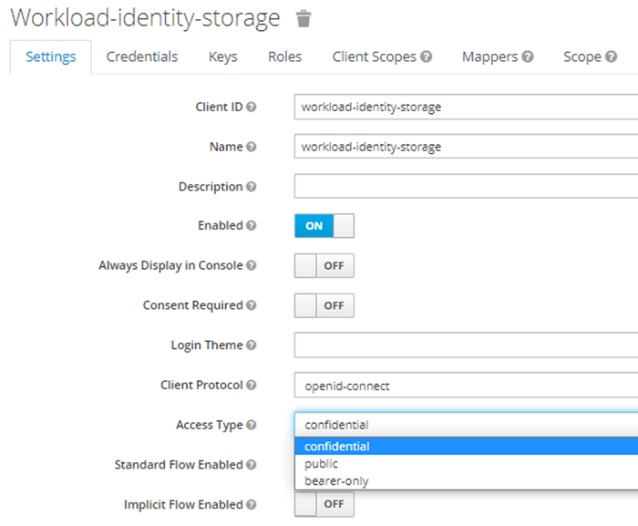

# Service Configuration for Baremetal

## Table of Contents <a name="TOC"></a>
* [Environment variables](#Environment-variables)
  * [Common properties for all environments](#Common-properties-for-all-environments)
  * [For Mappers to activate drivers](#For-Mappers-to-activate-drivers)
* [Requirements for requests](#Requirements-for-requests)
* [Configuring mappers Datasources](#Configuring-mappers-DataSources)
  * [For OSM Postgres](#For-OSM-Postgres)
    * [Postgres schema configuration](#Postgres-schema-configuration)
  * [For OBM MinIO](#For-OBM-MinIO)
    * [Object store configuration](#ObjectStoreConfig)
  * [For OQM RabbitMQ](#For-OQM-RabbitMQ)
    * [Exchanges and queues configuration](#Exchanges-and-queues-configuration)
* [Interaction with message brokers](#Interaction-with-message-brokers)
* [Keycloak configuration](#Keycloak-configuration)
* [Running E2E Tests](#Running-E2E-Tests)
* [Running locally](#Running-locally)
* [License](#License)

## Environment variables

### Common properties for all environments

Define the following environment variables.

Must have:

| name                                      | value                                                      | description                                                                                                                                                                                                                               | sensitive? | source |
|-------------------------------------------|------------------------------------------------------------|-------------------------------------------------------------------------------------------------------------------------------------------------------------------------------------------------------------------------------------------|------------|--------|
|                                           | false                                                      | -                                                                                                                                                                                                                                         |
| `OPENID_PROVIDER_CLIENT_ID`               | `*****`                                                    | Client id that represents this service and serves to request tokens, example `workload-identity-legal`                                                                                                                                    | yes        | -      |
| `OPENID_PROVIDER_CLIENT_SECRET`           | `*****`                                                    | This client secret that serves to request tokens                                                                                                                                                                                          | yes        | -      |
| `OPENID_PROVIDER_URL`                     | `https://keycloack.com/auth/realms/master`                 | URL of OpenID Connect provider, it will be used as `<OpenID URL> + /.well-known/openid-configuration` to auto configure endpoint for token request                                                                                        | no         | -      |
| `<POSTGRES_PASSWORD_ENV_VARIABLE_NAME>`   | ex `POSTGRES_PASS_OSDU`                                    | Postgres password env name, name of that variable not defined at the service level, the name will be received through partition service. Each tenant can have it's own ENV name value, and it must be present in ENV of Storage service   | yes        | -      |
| `<MINIO_SECRETKEY_ENV_VARIABLE_NAME>`     | ex `MINIO_SECRET_OSDU`                                     | Minio secret env name, name of that variable not defined at the service level, the name will be received through partition service. Each tenant can have it's own ENV name value, and it must be present in ENV of Storage service        | yes        | -      |
| `<AMQP_PASSWORD_ENV_VARIABLE_NAME>`       | ex `AMQP_PASS_OSDU`                                        | Amqp password env name, name of that variable not defined at the service level, the name will be received through partition service. Each tenant can have it's own ENV name value, and it must be present in ENV of Storage service       | yes        | -      |
| `<AMQP_ADMIN_PASSWORD_ENV_VARIABLE_NAME>` | ex `AMQP_ADMIN_PASS_OSDU`                                  | Amqp admin password env name, name of that variable not defined at the service level, the name will be received through partition service. Each tenant can have it's own ENV name value, and it must be present in ENV of Storage service | yes        | -      |
| `STORAGE_SERVICE_ACCOUNT_EMAIL`           | `workload-storage@keycloak.com`                            | Storage service account email, used during OQM events processing                                                                                                                                                                          | no         | -      |

Defined in default application property file but possible to override:

| name                              | value                                        | description                         | sensitive? | source        |
|-----------------------------------|----------------------------------------------|-------------------------------------|------------|---------------|
| `MANAGEMENT_ENDPOINTS_WEB_BASE`   | ex `/`                                       | Web base for Actuator               | no         | -             |
| `MANAGEMENT_SERVER_PORT`          | ex `8081`                                    | Port for Actuator                   | no         | -             |

| name                                       | value                                                      | description                                                                                                                                                                            | sensitive? | source                              |
|--------------------------------------------|------------------------------------------------------------|----------------------------------------------------------------------------------------------------------------------------------------------------------------------------------------|------------|-------------------------------------|
| `LOG_PREFIX`                               | `storage`                                                  | Logging prefix                                                                                                                                                                         | no         | -                                   |
| `SERVER_SERVLET_CONTEXPATH`                | `/api/storage/v2/`                                         | Servlet context path                                                                                                                                                                   | no         | -                                   |
| `AUTHORIZE_API`                            | ex `https://entitlements.com/entitlements/v1`              | Entitlements API endpoint                                                                                                                                                              | no         | output of infrastructure deployment |
| `LEGALTAG_API`                             | ex `https://legal.com/api/legal/v1`                        | Legal API endpoint                                                                                                                                                                     | no         | output of infrastructure deployment |
| `PUBSUB_SEARCH_TOPIC`                      | ex `records-changed`                                       | RabbitMQ topic name for V1 messages (SOR namespace)                                                                                                                                    | no         |                                     |
| `PUBSUB_SEARCH_TOPIC_V2`                   | ex `records-changed-v2`                                    | RabbitMQ topic name for V2 messages (collaboration context)                                                                                                                            | no         | `records-changed-v2`                |
| `REDIS_STORAGE_HOST`                       | ex `127.0.0.1`                                             | Redis host for storage                                                                                                                                                                 | no         |                                     |
| `REDIS_STORAGE_PASSWORD`                   | ex `*****`                                                 | Redis storage host password                                                                                                                                                            | yes        |                                     |
| `REDIS_STORAGE_WITH_SSL`                   | ex `true` or `false`                                       | Redis storage host ssl config                                                                                                                                                          | no         |                                     |
| `REDIS_STORAGE_EXPIRATION`                 | ex `30`                                                    | Redis storage cache expiration in seconds                                                                                                                                              | no         |                                     |
| `REDIS_GROUP_HOST`                         | ex `127.0.0.1`                                             | Redis host for storage groups                                                                                                                                                          | no         |                                     |
| `REDIS_GROUP_PASSWORD`                     | ex `*****`                                                 | Redis storage groups host password                                                                                                                                                     | yes        |                                     |
| `REDIS_GROUP_WITH_SSL`                     | ex `true` or `false`                                       | Redis storage groups host ssl config                                                                                                                                                   | no         |                                     |
| `REDIS_GROUP_EXPIRATION`                   | ex `30`                                                    | Redis storage groups cache expiration in seconds                                                                                                                                       | no         |                                     |
| `POLICY_API`                               | ex `http://localhost:8080/api/policy/v1/`                  | Police service endpoint                                                                                                                                                                | no         | output of infrastructure deployment |
| `POLICY_ID`                                | ex `search`                                                | policeId from ex `http://localhost:8080/api/policy/v1/policies`. Look at `POLICY_API`                                                                                                  | no         | -                                   |
| `PARTITION_API`                            | ex `http://localhost:8081/api/partition/v1`                | Partition service endpoint                                                                                                                                                             | no         | -                                   |
| `PARTITION_PROPERTIES_STORAGE_BUCKET_NAME` | ex `storage.bucket.name`                                   | Name of partition property for storage bucket name value                                                                                                                               | yes        | -                                   |
| `feature.replay.enabled`                   | ex `true` or `false`                                       | `Replay API` feature flag                                                                                                                                                              | no         |                                     |
| `OTEL_EXPORTER_OTLP_ENDPOINT`              | ex `http://127.0.0.1:4318`                                 | OpenTelemetry collector endpoint                                                                                                                                                       | no         |                                     |
| `JAVA_TOOL_OPTIONS`                        | ex `-javaagent:/app/telemetry/opentelemetry-javaagent.jar` | Used to extend application runtime arguments. Currently intended to enable the OpenTelemetry Java agent, which is included in the container and can be activated via runtime arguments | no         |                                     |

These variables define service behavior, and are used to switch between `Reference` or `Google Cloud` environments, their overriding and usage in mixed mode was not tested.
Usage of spring profiles is preferred.

| name                     | value                | description                                                                                                               | sensitive? | source |
|--------------------------|----------------------|---------------------------------------------------------------------------------------------------------------------------|------------|--------|
| `PARTITION_AUTH_ENABLED` | ex `true` or `false` | Disable or enable auth token provisioning for requests to Partition service                                               | no         | -      |
| `OSMDRIVER`              | `postgres`           | Osm driver mode that defines which KV storage will be used                                                                | no         | -      |
| `OBMDRIVER`              | `minio`              | Obm driver mode that defines which object storage will be used                                                            | no         | -      |
| `OQMDRIVER`              | `rabbitmq`           | Oqm driver mode that defines which message broker will be used                                                            | no         | -      |
| `SERVICE_TOKEN_PROVIDER` | `GCP` or `OPENID`    | Service account token provider, `GCP` means use Google service account `OPEIND` means use OpenId provider like `Keycloak` | no         | -      |

### Properties set in Partition service:

Note that properties can be set in Partition as `sensitive` in that case in property `value` should be present **not value itself**, but **ENV variable name**.
This variable should be present in environment of service that need that variable.

Example:
```
    "elasticsearch.port": {
      "sensitive": false, <- value not sensitive 
      "value": "9243"  <- will be used as is.
    },
      "elasticsearch.password": {
      "sensitive": true, <- value is sensitive 
      "value": "ELASTIC_SEARCH_PASSWORD_OSDU" <- service consumer should have env variable ELASTIC_SEARCH_PASSWORD_OSDU with elastic search password
    }
```

### For Mappers to activate drivers

| name      | value     | description                                             |
|-----------|-----------|---------------------------------------------------------|
| OSMDRIVER | datastore | to activate **OSM** driver for **Google Datastore**     |
| OSMDRIVER | postgres  | to activate **OSM** driver for **PostgreSQL**           |
| OBMDRIVER | gcs       | to activate **OBM** driver for **Google Cloud Storage** |
| OBMDRIVER | minio     | to activate **OBM** driver for **MinIO**                |
| OQMDRIVER | pubsub    | to activate **OQM** driver for **Google PubSub**        |
| OQMDRIVER | rabbitmq  | to activate **OQM** driver for **Rabbit MQ**            |

## Requirements for requests

Record identifiers cannot contain a space character. At the same time, they may contain a % character, which, when
combined with subsequent numeric characters, may cause the application to misinterpret that combination. For example,
the "%20" combination will be interpreted as a space " " character. To correctly transfer such an identifier, you should
additionally perform the url-encode operation on it. This functionality can be built into the front-end application, or
you can use an online url-encoder tool ( eg.: https://www.urlencoder.org/). Thus, having ID "osdu:
work-product-component--WellboreMarkerSet:3D%20Kirchhoff%20DepthMigration" (with %20 combination)
you should url-encode it and request
"osdu%3Awork-product-component--WellboreMarkerSet%3A3D%2520Kirchhoff%2520DepthMigration" instead.

## Configuring mappers DataSources

When using non-Google-Cloud-native technologies, property sets must be defined on the Partition service as part of
PartitionInfo for each Tenant.

They are specific to each storage technology:

### For OSM Postgres

**database structure**
OSM works with data logically organized as "partition"->"namespace"->"kind"->"record"->"columns". The above sequence
describes how it is named in Google Datastore, where "partition" maps to "Google Cloud project".

For example, this is how **Datastore** OSM driver contains records for "RecordsChanged" data register:

| hierarchy level     | value                            |
|---------------------|----------------------------------|
| partition (opendes) | osdu-cicd-epam                   |
| namespace           | opendes                          |
| kind                | StorageRecord                    |
| record              | `<multiple kind records>`        |
| columns             | acl; bucket; kind; legal; etc... |

And this is how **Postgres** OSM driver does. Notice, the above hierarchy is kept, but Postgres uses alternative entities
for it.

| Datastore hierarchy level          |     | Postgres alternative used  |
|------------------------------------|-----|----------------------------|
| partition (Google Cloud project)   | ==  | Postgres server URL        |
| namespace                          | ==  | Schema                     |
| kind                               | ==  | Table                      |
| record                             | ==  | '<multiple table records>' |
| columns                            | ==  | id, data (jsonb)           |

As we can see in the above table, Postgres uses different approach in storing business data in records. Not like
Datastore, which segments data into multiple physical columns, Postgres organises them into the single JSONB "data"
column. It allows provisioning new data registers easily not taking care about specifics of certain registers structure.
In the current OSM version (as on December'21) the Postgres OSM driver is not able to create new tables in runtime.

So this is a responsibility of DevOps / CI/CD to provision all required SQL tables (for all required data kinds) when on new
environment or tenant provisioning when using Postgres. Detailed instructions (with examples) for creating new tables is
in the **OSM module Postgres driver README.md** `org/opengroup/osdu/core/gcp/osm/translate/postgresql/README.md`

As a quick shortcut, this example snippet can be used by DevOps DBA:
```postgres-psql
--CREATE SCHEMA "exampleschema";
CREATE TABLE exampleschema."ExampleKind"(
    id text COLLATE pg_catalog."default" NOT NULL,
    pk bigint NOT NULL GENERATED ALWAYS AS IDENTITY PRIMARY KEY,
    data jsonb NOT NULL,
    CONSTRAINT ExampleKind_id UNIQUE (id)
);
CREATE INDEX ExampleKind_datagin ON exampleschema."ExampleKind" USING GIN (data);
```

**prefix:** `osm.postgres`
It can be overridden by:

- through the Spring Boot property `osm.postgres.partition-properties-prefix`
- environment variable `OSM_POSTGRES_PARTITION_PROPERTIES_PREFIX`

**PropertySet:**

| Property | Description |
| --- | --- |
| osm.postgres.datasource.url | server URL |
| osm.postgres.datasource.username | username |
| osm.postgres.datasource.password | password |

<details><summary>Example of a definition for a single tenant</summary>

```

curl -L -X PATCH 'https://api/partition/v1/partitions/opendes' -H 'data-partition-id: opendes' -H 'Authorization: Bearer ...' -H 'Content-Type: application/json' --data-raw '{
  "properties": {
    "osm.postgres.datasource.url": {
      "sensitive": false,
      "value": "jdbc:postgresql://127.0.0.1:5432/postgres"
    },
    "osm.postgres.datasource.username": {
      "sensitive": false,
      "value": "postgres"
    },
    "osm.postgres.datasource.password": {
      "sensitive": true,
      "value": "<POSTGRES_PASSWORD_ENV_VARIABLE_NAME>" <- (Not actual value, just name of env variable)
    }
  }
}'

```

</details>

#### Postgres schema configuration

```
--CREATE SCHEMA "opendes";
--DROP TABLE opendes."StorageRecord";
CREATE TABLE opendes."StorageRecord"(
    id text COLLATE pg_catalog."default" NOT NULL,
    pk bigint NOT NULL GENERATED ALWAYS AS IDENTITY PRIMARY KEY,
    data jsonb NOT NULL,
    CONSTRAINT StorageRecord_id UNIQUE (id)
);
CREATE INDEX StorageRecord_datagin ON opendes."StorageRecord" USING GIN (data);
-----------------
--DROP TABLE opendes."StorageSchema";
CREATE TABLE opendes."StorageSchema"(
    id text COLLATE pg_catalog."default" NOT NULL,
    pk bigint NOT NULL GENERATED ALWAYS AS IDENTITY PRIMARY KEY,
    data jsonb NOT NULL,
    CONSTRAINT StorageSchema_id UNIQUE (id)
);
CREATE INDEX StorageSchema_datagin ON opendes."StorageSchema" USING GIN (data);

-----------------
--DROP TABLE opendes."ReplayStatus";
CREATE TABLE opendes."ReplayStatus"(
    id text COLLATE pg_catalog."default" NOT NULL,
    pk bigint NOT NULL GENERATED ALWAYS AS IDENTITY PRIMARY KEY,
    data jsonb NOT NULL,
    CONSTRAINT ReplayStatus_id UNIQUE (id)
);
CREATE INDEX ReplayStatus_datagin ON opendes."ReplayStatus" USING GIN (data);
```


Example of filling tables

```

INSERT INTO <partitionId>."StorageRecord"(
id, data)
VALUES ('726612843', '{
  "id": 726612843,
  ...
}');

```

### For OBM MinIO

**prefix:** `obm.minio`
It can be overridden by:

- through the Spring Boot property `osm.postgres.partition-properties-prefix`
- environment variable `OBM_MINIO_PARTITION_PROPERTIES_PREFIX`

**PropertySet:**

| Property            | Description            |
|---------------------|------------------------|
| obm.minio.endpoint  | server URL             |
| obm.minio.accessKey | credentials access key |
| obm.minio.secretKey | credentials secret key |

<details><summary>Example of a definition for a single tenant</summary>

```

curl -L -X PATCH 'https:///api/partition/v1/partitions/opendes' -H 'data-partition-id: opendes' -H 'Authorization: Bearer ...' -H 'Content-Type: application/json' --data-raw '{
  "properties": {
    "obm.minio.endpoint": {
      "sensitive": false,
      "value": "http://localhost:9000"
    },
    "obm.minio.accessKey": {
      "sensitive": false,
      "value": "minioadmin"
    },
    "obm.minio.secretKey": {
      "sensitive": true,
      "value": "<MINIO_SECRETKEY_ENV_VARIABLE_NAME>" <- (Not actual value, just name of env variable)
    }
  }
}'

```

</details>

### Object store configuration <a name="ObjectStoreConfig"></a>

#### Used Technology

MinIO (or any other supported by OBM)

#### Per-tenant buckets configuration

These buckets must be defined in tenants’ dedicated object store servers. 
OBM connection properties of these servers (url, etc.) are defined as specific properties in tenants’ PartitionInfo registration objects at the Partition service as described in accordant sections of this document.


<table>
  <tr>
   <td>Bucket Naming template 
   </td>
   <td>Permissions required
   </td>
  </tr>
  <tr>
   <td>&lt;PartitionInfo.projectId-PartitionInfo.name><strong>-records</strong>
   </td>
   <td>ListObjects, CRUDObject
   </td>
  </tr>
</table>

or

We can use Partition Service to get a bucket name:

```
curl -L -X PATCH 'https:///api/partition/v1/partitions/opendes' -H 'data-partition-id: opendes' -H 'Authorization: Bearer ...' -H 'Content-Type: application/json' --data-raw '{
  "properties": {
    "partition.properties.storage.bucket.name": {
      "sensitive": true,
      "value": "PARTITION_PROPERTIES_STORAGE_BUCKET_NAME"
    }
  }
}'

```

### For OQM RabbitMQ

**prefix:** `oqm.rabbitmq`
It can be overridden by:

- through the Spring Boot property `oqm.rabbitmq.partition-properties-prefix`
- environment variable `OQM_RABBITMQ_PARTITION_PROPERTIES_PREFIX``

**PropertySet** (for two types of connection: messaging and admin operations):

| Property | Description |
| --- | --- |
| oqm.rabbitmq.amqp.host | messaging hostname or IP |
| oqm.rabbitmq.amqp.port | - port |
| oqm.rabbitmq.amqp.path | - path |
| oqm.rabbitmq.amqp.username | - username |
| oqm.rabbitmq.amqp.password | - password |
| oqm.rabbitmq.admin.schema | admin host schema |
| oqm.rabbitmq.admin.host | - host name |
| oqm.rabbitmq.admin.port | - port |
| oqm.rabbitmq.admin.path | - path |
| oqm.rabbitmq.admin.username | - username |
| oqm.rabbitmq.admin.password | - password |

<details><summary>Example of a single tenant definition</summary>

```

curl -L -X PATCH 'https://api/partition/v1/partitions/opendes' -H 'data-partition-id: opendes' -H 'Authorization: Bearer ...' -H 'Content-Type: application/json' --data-raw '{
  "properties": {
    "oqm.rabbitmq.amqp.host": {
      "sensitive": false,
      "value": "localhost"
    },
    "oqm.rabbitmq.amqp.port": {
      "sensitive": false,
      "value": "5672"
    },
    "oqm.rabbitmq.amqp.path": {
      "sensitive": false,
      "value": ""
    },
    "oqm.rabbitmq.amqp.username": {
      "sensitive": false,
      "value": "guest"
    },
    "oqm.rabbitmq.amqp.password": {
      "sensitive": true,
      "value": "<AMQP_PASSWORD_ENV_VARIABLE_NAME>" <- (Not actual value, just name of env variable)
    },
     "oqm.rabbitmq.admin.schema": {
      "sensitive": false,
      "value": "http"
    },
     "oqm.rabbitmq.admin.host": {
      "sensitive": false,
      "value": "localhost"
    },
    "oqm.rabbitmq.admin.port": {
      "sensitive": false,
      "value": "9002"
    },
    "oqm.rabbitmq.admin.path": {
      "sensitive": false,
      "value": "/api"
    },
    "oqm.rabbitmq.admin.username": {
      "sensitive": false,
      "value": "guest"
    },
    "oqm.rabbitmq.admin.password": {
      "sensitive": true,
      "value": "<AMQP_ADMIN_PASSWORD_ENV_VARIABLE_NAME>" <- (Not actual value, just name of env variable)
    }
  }
}'

```

</details>

## Exchanges and queues configuration

At RabbitMq should be created set of exchanges and queues.

| topic name                                    | subscription name                    | description                                                | sensitive? | env var to override                                                     |
|-----------------------------------------------|--------------------------------------|------------------------------------------------------------|------------|-------------------------------------------------------------------------|
| `records-changed`                             | -                                    | Search topic for pushing                                   | yes        | `PUBSUB_SEARCH_TOPIC`                                                   |
| `legaltags-changed`                           | `storage-oqm-legaltags-changed`      | Legaltags topic for consuming                              | yes        | `LEGAL_TAGS_CHANGED_TOPIC_NAME`, `LEGAL_TAGS_CHANGED_SUBSCRIPTION_NAME` |
| `storage-oqm-legaltags-changed-exchange`      | -                                    | Service topic for delaying failed legal tag changed events | -          | -                                                                       |
| `storage-oqm-legaltags-changed-exchange`      | -                                    | Service topic for delaying failed legal tag changed events | -          | -                                                                       |
| `reindex`                                     | -                                    | "reindex" topic for pushing                                | yes        | map `REPLAY_OPERATION_ROUTING_PROPERTIES`                               |
| `replaytopic`                                 | `replaytopicsubscription`            | "Replay" topic for consuming                               | yes        | map `REPLAY.ROUTING_PROPERTIES`                                         |
| `replaytopicsubscription-exchange`            | `dead-lettering-replay-subscription` | Service topic for delaying failed 'replay' events          | yes        | `REPLAY_DEAD_LETTER_TOPIC_NAME`, `REPLAY_DEAD_LETTER_SUBSCRIPTION_NAME` |
| `dead-lettering-replay-subscription-exchange` | -                                    | Service topic for delaying failed 'replay' events          | yes        | `REPLAY_DEAD_LETTER_TOPIC_NAME`, `REPLAY_DEAD_LETTER_SUBSCRIPTION_NAME` |


## Interaction with message brokers

### Specifics of work through PULL subscription

To receive messages from brokers, this solution uses the PULL-subscriber mechanism to get 'record_changed' messages.
This is its cardinal difference from other implementations that use PUSH-subscribers (webhooks). This opens a wide
choice when choosing brokers.

When using PULL-subscribers, there is a need to restore Storage service subscribers at the start of Storage service.
This magic happens in the `OqmSubscriberManager.java` class from `OQM` in the @PostConstruct method.

## Keycloak configuration

[Keycloak service accounts setup](https://www.keycloak.org/docs/latest/server_admin/#_service_accounts)

Configure Clients. One Client per OSDU service. Set them “confidential”.



Each Client has embedded Service Account (SA) option. Enable SAs for Clients, make “Authorization enabled”:


Add `partition-and-entitlements` scope to `Default Client Scopes` and generate Keys.

Give `client-id` and `client-secret` to services, which should be authorized within the platform.

### OpenTelemetry Integration

The `opentelemetry-javaagent.jar` file is the OpenTelemetry Java agent.
It is used to automatically instrument a Java application at runtime without requiring manual changes to the source code.

This provides critical observability features:

* **Distributed tracing:** Traces the path of requests as they travel across different services.
* **Metrics:** Captures performance indicators and application-level metrics.
* **Logs:** Correlates logs with traces and other telemetry data.

Enabling this agent makes it significantly easier to monitor, debug, and manage the application in development and production environments.
The agent is activated via runtime arguments when the `JAVA_TOOL_OPTIONS` environment variable includes the `-javaagent:/app/telemetry/opentelemetry-javaagent.jar` argument.

The agent is available from the official OpenTelemetry GitHub repository. It is recommended to use the latest stable version.

Official Download Page:
https://github.com/open-telemetry/opentelemetry-java-instrumentation/releases

## Running E2E Tests

You will need to have the following environment variables defined.

| name                                           | value                                          | description                                                      | sensitive?                                        | source |
|------------------------------------------------|------------------------------------------------|------------------------------------------------------------------|---------------------------------------------------|--------|
| `DEPLOY_ENV`                                   | `empty`                                        | Required but not used, should be set up with string "empty"      | no                                                | -      |
| `GROUP_ID`                                     | ex`opendes-gc.projects.com`                    | OSDU R2 to run tests under                                       | no                                                | -      |
| `LEGAL_URL`                                    | ex`http://localhsot:8080/api/legal/v1/`        | Legal API endpoint                                               | no                                                | -      |
| `STORAGE_URL`                                  | ex`http://localhost:8080/api/storage/v2/`      | Endpoint of storage service                                      | no                                                | -      |
| `TENANT_NAME`                                  | ex `opendes`                                   | OSDU tenant used for testing                                     | no                                                | --     |
| `TEST_OPENID_PROVIDER_CLIENT_ID`               | `********`                                     | Client Id for `$INTEGRATION_TESTER`                              | yes                                               | --     |
| `TEST_OPENID_PROVIDER_CLIENT_SECRET`           | `********`                                     |                                                                  | Client secret for `$INTEGRATION_TESTER`           | --     |
| `TEST_NO_ACCESS_OPENID_PROVIDER_CLIENT_ID`     | `********`                                     | Client Id for `$NO_ACCESS_INTEGRATION_TESTER`                    | yes                                               | --     |
| `TEST_NO_ACCESS_OPENID_PROVIDER_CLIENT_SECRET` | `********`                                     |                                                                  | Client secret for `$NO_ACCESS_INTEGRATION_TESTER` | --     |
| `TEST_OPENID_PROVIDER_URL`                     | `https://keycloak.com/auth/realms/osdu`        | OpenID provider url                                              | yes                                               | --     |
| `OPA_INTEGRATION_ENABLED`                      | `true` OR `false`                              | Should be update if integration with OPA\Policy enabled\disabled | no                                                | --     |
| `ENTITLEMENTS_URL`                             | ex`http://localhost:8080/api/entitlements/v2/` | Endpoint of entitlements service                                 | no                                                | -      |
| `DATA_ROOT_OPENID_PROVIDER_CLIENT_ID`          | `********`                                     | Client Id for data root tester                                   | yes                                               | -      |
| `DATA_ROOT_OPENID_PROVIDER_CLIENT_SECRET`      | `********`                                     | Client secret for data root tester                               | yes                                               | -      |

**Entitlements configuration for integration accounts**

| INTEGRATION_TESTER        | NO_DATA_ACCESS_TESTER     | DATA_ROOT_TESTER          | 
|---------------------------|---------------------------|---------------------------|
| users                     | users                     | users                     |
| service.entitlements.user | service.storage.admin     | users.data.root           |                                                                                       |
| service.storage.admin     | service.entitlements.user | service.entitlements.user |
| service.storage.creator   |                           | service.storage.viewer    |
| service.storage.viewer    |                           |                           |
| service.legal.admin       |                           |                           |
| service.legal.editor      |                           |                           |
| data.test1                |                           |                           |
| data.integration.test     |                           |                           |


Execute following command to build code and run all the integration tests:

 ```bash
 # Note: this assumes that the environment variables for integration tests as outlined
 #       above are already exported in your environment.
 # build + install integration test core
 $ (cd testing/storage-test-core/ && mvn clean install)
 ```

 ```bash
 # build + run Google Cloud integration tests.
 $ (cd testing/storage-test-baremetal/ && mvn clean test)
 ```


## Running locally
To run storage service locally connected with baremetal environment:
#### Specify mappers drivers property or run `SPRING_PROFILES_ACTIVE=anthos`
```properties
obmDriver=minio
osmDriver=postgres
oqmDriver=rabbitmq
```
#### Specify osdu services urls:
```properties
HOST=https://osdu.ref.gcp.gnrg-osdu.projects.epam.com
AUTHORIZE_API=${HOST}/api/entitlements/v2
CRS_API=${HOST}/api/crs/v2
LEGALTAG_API=${HOST}/api/legal/v1
PARTITION_API=${HOST}/api/partition/v1/
```
#### Auth variables:
```properties
opa.enabled=false;
partition-auth-enabled=false
service.token.provider=OPENID
OPENID_PROVIDER_CLIENT_ID=${CLIENT_ID};
OPENID_PROVIDER_CLIENT_SECRET=${CLIENT_SECRET};
OPENID_PROVIDER_URL=${OPENID_PROVIDER_URL};
```
#### Redis variables:
```properties
REDIS_STORAGE_HOST=127.0.0.1
REDIS_GROUP_HOST=127.0.0.1
```
#### Partition service should contain non-production sensitive properties to override them with localhost and use through a custom prefixes.
##### OSM:
```properties
POSTGRES_DATASOURCE_URL_OSDU=jdbc:postgresql://localhost:5432/storage;
POSTGRES_DB_USERNAME_OSDU=${POSTGRES_USERNAME};
POSTGRES_DB_PASSWORD_OSDU=${POSTGRES_PASSWORD};
```
##### OBM:
```properties
OBM_MINIO_PARTITION_PROPERTIES_PREFIX=obm.minio.localDebug;
MINIO_ACCESS_KEY=${MINIO_ACCESS_KEY};
MINIO_SECRET_KEY=${MINIO_SECRET_KEY};
```
##### OQM:
```properties
OQM_RABBITMQ_PARTITION_PROPERTIES_PREFIX=oqm.rabbitmq.localDebug;
RABBIT_MQ_HOST=localhost;
RABBITMQ_ADMIN_HOST=localhost;
RABBITMQ_ADMIN_USERNAME=${RABBITMQ_ADMIN_USERNAME};
RABBITMQ_ADMIN_PASSWORD=${RABBITMQ_ADMIN_PASSWORD};
```
#### To connect postgres or minio or rabbitmq port-forwarding should be used:
```shell
gcloud auth list
gcloud config set account <account_name>
gcloud config set project <project_name>
kubectl port-forward <rabbit_pod_name> 15672:15672
kubectl port-forward <rabbit_pod_name> 5672:5672
kubectl port-forward <minio_pod_name> 9000:9000
gcloud components install cloud_sql_proxy
cloud_sql_proxy -instances=<instance_connection_string> -credential_file=<baremetal_service_account_json_file>
```

## License

Copyright © Google LLC

Copyright © EPAM Systems

Licensed under the Apache License, Version 2.0 (the "License");
you may not use this file except in compliance with the License.
You may obtain a copy of the License at

[http://www.apache.org/licenses/LICENSE-2.0](http://www.apache.org/licenses/LICENSE-2.0)

Unless required by applicable law or agreed to in writing, software
distributed under the License is distributed on an "AS IS" BASIS,
WITHOUT WARRANTIES OR CONDITIONS OF ANY KIND, either express or implied.
See the License for the specific language governing permissions and
limitations under the License.
